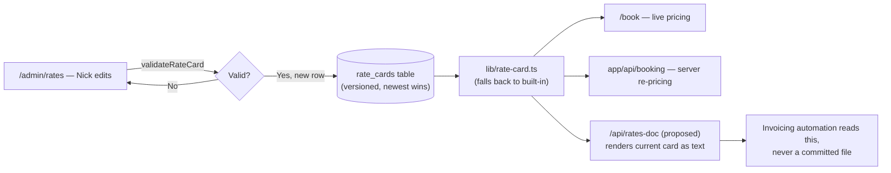

# Sala Nera — Handoff (updated Sep 22 2026)

## Start here — state at Sep 22, 15:35 UTC

**Zip Stage 1 is LIVE** (`11e8976`, migration 0008 applied by Nick first). The table's code went live as `a7a5b2c` (schema only,
nothing uses it). **Next steps, in order:**
1. ~~Nick runs the migrate one-liner.~~ **Done, Sep 22 15:16 UTC**: confirmed
   read-only, `0008_archives` applied, table and unique index present, empty.
2. ~~Push the Stage 1 commit.~~ **Live, Sep 22 ~15:25 UTC** (`11e8976`).
   Checked read-only as admin (page views only, no POSTs):
   - `/admin/listings/2` shows the Delivery panel at the top, with both zips
     "Not made yet" and Prepare downloads. Its history is grouped ("33 files
     at once" ×2).
   - `/portal/rockwall-shores-drive` shows High/Low res, Download all photos
     and "Download film · 127 MB", with no checkboxes.
   - There is no sideways scroll at 390px.
3. **Nick's live test** is next, then my read-only check. Steps are in the zip
   section. No zip has been built yet: `archives` is empty.

**Built and live, Sep 21–22** (details in the dated sections below):

| What | Commit | Proven live by Nick? |
|---|---|---|
| High res / Low res download switch | `97c3445` | Sizes and names **yes**; **Download All is broken in Chrome** (see below) |
| Every booking creates its own listing (migration 0006) | `f9f203a` | **Yes**, Sep 22 13:40 UTC (booking 4) |
| "Send delivery email" button (migration 0007) | `0b879e8` | **Yes**, Sep 22 00:00 UTC, Rockwall → his Gmail |
| Admin has its own sign-in at /admin/login | `9803434` | **Yes**, on his new computer |
| Agents reschedule or cancel their own booking | `7e5cc6e` | **Yes**, Sep 22 13:40–13:46 UTC (booking 4) |

**Reschedule and cancel: proven by Nick, Sep 22.** He booked 5910 Firecrest Dr
as his Gmail (booking 4, listing `firecrest-dr`), moved it Wed Oct 7 9am → Mon
Oct 5 11am, then cancelled. He saw it move and then vanish on his Google
Calendar, vanish from the agent portal, and got both admin emails. Checked
read-only: events `sent` → `client_rescheduled` → `client_cancelled`, no
`change_email_failed`, booking 4 `cancelled`, its listing gone (only listings 1
and 2 remain). **Nick's rule: the UI of this may be tweaked later, but do not
touch the wiring** (`lib/booking-changes.ts`, `app/portal/[slug]/actions.ts`,
the guarded UPDATEs, calendar and email calls). It works as is.

**Download All does not work in Chrome (Nick, Sep 22 13:35 UTC, Rockwall).** The
page "freaked out" and only the **first** file arrived, at both sizes. The
switch itself works: he got the photo at both sizes with the right names. The
logs (32 `low` + the film `high`, then 33 `high`) record links handed out, not
files received, so I wrongly called this proven at first. **Fixed by Download
all photos zips, Stage 1: built, waiting on the migration** (next section).

**Still waiting on Nick (his test, then my read-only check):**
1. **A horizontal film upload**, and **a fresh photo upload** that makes its own
   copies (`grid_key` set without pressing Make previews). Latest media id is 56.

**Decided and built (Stage 1):** the "Send delivery email" button is now at the
**top** of the listing page, in a Delivery panel with the zips' status.

**UI tweaks Nick wants, not yet discussed:** the download area (after the zips)
and the reschedule/cancel screens (UI only, never the wiring).

**Client-journey gaps left, in Nick's order:**
1. **Real prices and terms.** Both are still placeholders (`RATES_ARE_PLACEHOLDER`,
   `TERMS_ARE_PLACEHOLDER`). His real rates are on his live Spiro page.
2. **Check Spiro reads the same calendar.** If it doesn't, Spiro could sell a day
   Sala Nera already booked. Test: block a time by hand on "Blackhall Media Group
   Appointments", then see if Spiro still offers it.
3. **Payment: Stripe, "eventually"** (Nick, Sep 21). Parked. The dead invoice
   button is hidden, and payment is arranged with Nick, who unlocks the listing.

**Rules and gotchas from this session:**
- **`.env.local` is the production database.** Never send a write-capable
  request as the admin to a local dev server (see the Sep 21 incident below).
  Prove action gating in the pglite harness instead.
- Migrations: ship the `lib/portal-migration.ts` change first, have **Nick** run
  the migrate one-liner (auto mode refuses it for me), confirm in
  `portal_migrations`, then deploy the code that uses it:
  `node --env-file=.env.local -e "fetch('https://salanera.com/api/portal/migrate',{method:'POST',headers:{Authorization:'Bearer '+process.env.MIGRATE_TOKEN}}).then(r=>r.text()).then(console.log)"`
- `.env.local` has `PORTAL_URL=http://localhost:3000`. Running `next dev` on
  another port, set `PORTAL_URL=http://localhost:<port>`, or sign-out and email
  links point at the wrong place.
- `kill`ing the `npx next dev` PID leaves its `next-server` child holding the
  port, and an old server keeps answering. Check `ss -ltnp | grep 3217` and kill
  both PIDs.
- Check scripts (all in `reference/`, run with `node --import
  ./scripts/ts-alias-hook.mjs`): check-booking-changes (42), check-admin-signin
  (29), check-delivery-email (35), check-booking-listing (33), check-downloads,
  check-listing-delete, check-copies-action, check-claim. All pass at `7e5cc6e`.

## Sep 22: Download All becomes zips — STAGE 1 LIVE (`11e8976`), NICK TO TEST

### Stage 1 as built (Sep 22, afternoon)

Waiting on migration 0008, then a push. The agreed plan is below this
subsection, and the build follows it except where noted.

**Where things are:**
- `lib/zip.ts` is the ZIP writer.
- `lib/archives.ts` holds build, claim, reuse, discard, fallback and notify.
- `app/api/portal/download/archive/route.ts` is the client endpoint, plus a
  demo-mode zip made on the spot.
- `lib/storage.ts` gained `objectSize` (HEAD), `readObject`,
  `putObjectStream`, `ARCHIVE_TTL`, and `deleteObjects` (moved from
  actions.ts).
- `app/admin/SendDelivery.tsx` is the Delivery panel, now at the top.
- In `app/admin/actions.ts`: `sendDeliveryAction` builds first for ready
  emails, and `prepareDownloadsAction` is new. Add, copies, reorder and delete
  call `discardStaleArchives`, and deleting a listing removes its zips.
- `app/components/Gallery.tsx` has "Download all photos", film buttons and
  sizes. Selection is removed.
- The admin listing page's `maxDuration` is 60 → 300. Its download history is
  now grouped into one line per download ("33 files at once").

**Changes from the plan, and why:**
- **One streamed PUT, not a multipart upload.** R2 accepts only GET, HEAD, PUT
  and DELETE through presigned URLs (checked in Cloudflare's docs), so multipart
  would need new header-based signing that can't be tested here. A single PUT
  uses the proven signing path:
  - The exact length is computed first: HEAD every photo, then `zipLength()`.
    The body streams with `duplex: 'half'`.
  - The limit is 4.995 GiB. Builds refuse above 5 GB with a clear message.
  - It is all or nothing, so there is nothing to abort.
  - If galleries ever outgrow it, move the builder to a Worker (as planned) or
    add multipart then.
- **The ZIP writer is our own, not client-zip.** Each photo is read whole
  (under 20 MB) before its header, so there are no data descriptors and the
  archive says ZIP 2.0. ZIP64 is used only past 4 GB or 65,535 entries.
  Streaming libraries mark every archive 4.5, and some unzippers balk at that.
- **Zip keys are unique per attempt:**
  `archives/<slug>/<version>/<8-hex>/photos-<res>.zip`. That way a slow, stale
  attempt can only ever delete its own file. Every row update is guarded on
  id, `r2_key` and `status = 'building'`.
- **Out-of-date zips are deleted, not just marked.** The version fingerprint is
  the real guard, since only a zip matching the current version is handed out.
- **Nick is emailed** (`NOTIFY_EMAIL`) when a client-triggered build fails.
  After a failure a client can't retry for 10 minutes; Nick's button retries at
  once. A row stuck in "building" for over 6 minutes counts as dead.
- **The `archives` table has `expires_at` already**, for Stage 2, so Stage 2
  needs no migration.

**Checks.** These scripts live in `reference/`, which is gitignored, so they
are in this workspace only:
- `check-zip.mjs` (33): Python zipfile, `unzip -t`, `unzip` and `bsdtar`
  extract identical bytes. It also forces ZIP64 on small files and tests the
  refusals.
- `check-archives.mjs` (75): the Stage 1 test list on pglite with a fake R2.
  Python opens every zip.
- `shoot-download-all.mjs` (23): demo-mode browser run. It downloads real zips
  and checks they're byte-identical, then covers preparing/failed states, the
  locked gallery and a 390px phone.
- `check-delivery-email` now seeds up-to-date zips before its ready email.
- `check-copies-action` gained a session stub.
- `next-server-stub.mjs` can collect `after()` work.
- All pass, as do check-downloads, listing-delete, reorder, claim,
  admin-signin, booking-changes, booking-listing, media-copies, property-site,
  sigv4, rates and scheduling. `npm run build` is clean.

**Nick's live test, after the push** (Rockwall's agent is his Gmail):
1. Open `/admin/listings/2`. The Delivery panel at the top should say "Not made
   yet" for both zips. Press **Prepare downloads** and wait (it should take
   well under a minute). Both should then say Ready, about 332 MB and 21 MB.
2. As his Gmail, in a private window, open `/portal/rockwall-shores-drive`.
   Press **Download all photos** on High res: one zip, 32 photos named
   "01 - …". Then do the same on Low res.
3. Do step 2 on his phone. The zip should land in Files and open there.
4. Press **Download film · 127 MB**.

Then I check read-only:
- `archives` rows and their bytes.
- The `archive_built` events: the build time is in their detail, and this is
  the first real timing.
- `downloads` grouped by timestamp.
- The `archive` events.


Agreed by Nick on Sep 22. He had a second agent review it twice, and its points
are folded in below. **Build it in two stages.** Nick said to plan only, so
nothing is built yet.

**The problem.** Download All (`app/components/Gallery.tsx`) fires one
download per file, 300ms apart. Chrome lets the first through and blocks the
rest behind an address-bar prompt that is easy to miss. Download Selected has
the same flaw with 2 or more files.

**Why this design, and not the others:**
- **Streaming a zip through Vercel to the client is out.** The team `bmg11` is
  on **Hobby**: 10 GB/month Fast Origin Transfer, and functions stop at 300s.
  One full high res Rockwall with its film is ~460 MB, and a slow client would
  hit the 300s limit.
- **Zipping in the browser is out.** Safari and iPhone run out of memory on high
  res, and it needs R2 CORS.
- **Cloudflare Worker: not yet.** It would add a second deployed service we
  don't need at this size. If a gallery ever takes more than 5 min to build,
  move *only the builder* there. The portal, table, auth and zip format stay.
- Nick knows **Hobby is non-commercial only** under Vercel's terms (Pro is
  required for a business). Upgrading is his call. Pro would also allow 800s.

**The design:**
- **Photos only. Films stay separate downloads**, one button each.
- **Two zips per listing**, high and low, choosing files the way `chooseFile()`
  does (high = original or `high_key`; low = `large_key`, falling back to
  the original).
- **Built on the server, from R2 back into R2:** stream each object, zip in
  **store** mode (JPEGs don't recompress), ZIP64, and stream into an **R2
  multipart upload** (5 MiB minimum part, except the last). Abort the multipart
  on failure. Never hold the whole zip in memory or on disk. `lib/storage.ts`
  only has whole-object `getObject`/`putObject` today, so streaming and multipart
  are new code.
- **Versioned keys:** `archives/<slug>/<version>/photos-high.zip` and
  `photos-low.zip`. The version fingerprints the photo keys, copies, filenames
  and order. A new version only becomes current once it's complete.
- **A new table (migration, so Nick runs the one-liner first):** for each listing,
  resolution and version it records building / ready / failed, size and
  built_at. Only one build runs at a time: a lock, later requests join it, and
  no endless retries.
- **When zips get built:**
  - The **ready** delivery email (listing unlocked) builds both zips first.
    **If fresh zips already exist, it reuses them and sends at once.**
  - **If a build fails, the ready email does not send.** Nick sees a clear error.
  - The **preview** email (listing locked) builds nothing and sends as today.
  - A **Rebuild downloads** button rebuilds without emailing anyone.
  - The admin listing page is `maxDuration = 60`. The build needs up to 300.
- **Invalidation:** uploading, deleting, replacing, **reordering** (numbers
  follow gallery order) or regenerating copies makes the current zips
  unavailable to new downloads **immediately**, then deletes them (best-effort).
  Deleting a listing deletes its archives too, alongside the existing file
  cleanup.
- **Client fallback**, for Rockwall (already delivered) and anything missing: an
  authorised request for a missing or stale zip starts one build, or joins the
  one running. The page shows "Preparing your photos…" and polls. A failure
  shows an honest error and is logged.
- **Download:** the same `authorizeListing()` gate (ownership, team, lock),
  then a signed R2 link. **The 1-hour link lifetime applies to completed zip links
  only.** `DOWNLOAD_TTL` (5 min) stays for previews, single photos and films. A
  longer lifetime makes an interrupted or resumed download more likely to
  succeed. It can't guarantee it.
- **Logging when the client requests the zip, not when it's built:** one bundle
  event (resolution, version, client), plus the per-photo `downloads` rows as
  today. As now, this means authorised or started, not completed.
- **Names:** zip files in ASCII only, `18-Rockwall-Shores-Drive_Photos_High-Res.zip`
  and `_Low-Res.zip` (the page can show prettier wording). Entries are
  `01 - <single-file name>` in gallery order (`sort`, then `id`), so low res
  keeps its `-low-res` suffix. Sanitise names: no folders, no path tricks, and
  duplicate names made unique.
- **iPhone:** the zip opens in the Files app. The photos do **not** go into Photos
  on their own. That's the parked polish item, not solved here.

**Stage 1 — build first:**
- Client page: **"Download all photos"** with the High/Low switch (High stays
  the default) and **sizes** shown once built. Each film gets its own button,
  e.g. "Download film · 127 MB". **Download Selected is hidden, and so are the
  selection checkboxes.** Single-photo download from the enlarged view is unchanged.
- Admin listing page: a delivery panel at the **top** with Send delivery email,
  the status (ready / preparing / needs rebuilding / failed) and Rebuild downloads.
- The builder, the table, invalidation and the fallback.
- **Tests.** In the pglite harness with fake R2:
  - the ready email builds both zips before sending
  - the preview email builds none
  - fresh zips are reused
  - upload, delete, regenerate and reorder each invalidate both zips
  - two simultaneous requests produce one build
  - a failed build stops the ready email
  - locked, unauthorised and signed-out clients get no zip link
  - films stay separate and are logged
  - zip names and numbered entries are correct

  **Live only**, because this workspace has no R2 keys: Nick runs Rebuild (or the
  fallback) on Rockwall, then downloads all photos at both sizes on computer
  **and** phone, and I check read-only.

**Stage 2 — afterwards:** Download Selected. One photo downloads directly. Two
or more become a **temporary zip** under a temp prefix, with an `expires_at` the
app enforces (no new links after it, whether or not Cloudflare has deleted the
file yet). Add an **R2 lifecycle rule** on that prefix (walk Nick through it in
Cloudflare), plus one that aborts incomplete multipart uploads. One build per
identical selection, version and resolution.

**Still open (UI talk, after the zips):** the Low res label. The second agent
suggested "Best for phone, web and social".

## Sep 22: agents reschedule or cancel their own booking — LIVE (`7e5cc6e`)

Nick's rules (asked directly, Sep 22): **up to 48 hours before the shoot**
(`CHANGE_CUTOFF_HOURS = MIN_NOTICE_HOURS`), and **only signed in to the client
portal** (no signed email link). He chose both recommendations.
- **Where:** the listing's "Shoot booked" page (`app/portal/[slug]/ManageBooking.tsx`)
  shows the booked day and time with **Reschedule** (the booking form's
  `SlotPicker` in its new `purpose="reschedule"` mode, with no date-request
  fallback) and **Cancel booking**. Inside 48h it says to reply to the
  confirmation or email Nick. The buttons show only on a listing a booking made,
  with nothing uploaded, whose booking is confirmed with a time.
- **Who:** `app/portal/[slug]/actions.ts` re-checks the session and ownership
  (team-aware, like downloads; the admin passes too), then calls
  `lib/booking-changes.ts`.
- **Move = one UPDATE** of the same booking row (new starts_at/ends_at/shoot_date),
  guarded on still confirmed, same old time and still ≥48h out. The one-a-day
  unique index refuses a day someone else took (23505 → "that time has just been
  taken"), and the agent keeps their time. Then the listing's shoot date is
  updated, a new calendar event is created, the id saved (null if the create
  failed, so /admin/bookings flags it), and the old event deleted.
- **Cancel** uses the same guarded UPDATE to 'cancelled', deletes the event, calls
  `releaseBookingListing()`, and redirects to `/portal?cancelled=1` (notice).
- **Emails:** Nick gets "Booking moved/cancelled by the agent — <address>" (was/now,
  who did it, a loud line if the calendar couldn't be updated), reply-to the agent.
  The agent gets "Your shoot is moved/cancelled". Logged as `booking/ok/client_rescheduled`
  and `client_cancelled`, with `change_email_failed` if a send fails.
- **The booking confirmation email** now links to `/portal/<slug>` and says it can
  be changed there up to 48 hours before.
- **Limitation:** no moving to another time on the same day. The agent's own
  booking makes that day show as taken.
- **Checks:** `reference/check-booking-changes.mjs` (42, all pass, calendar and
  Resend captured). check-booking-listing gained 2 confirmation-email checks (33).
  Browser run in demo mode (demo booking `DEMO_BOOKING`, 9am Sep 29) on laptop
  and phone. Live GET checks after deploy: /book, availability (32 open days),
  the agent portal, the cancelled notice, /admin/bookings and /p all fine.

## Sep 22: the admin has its own sign-in page — LIVE (`9803434`)

Nick opened salanera.com/admin on a new computer and got a 404: the admin gate
answered 404 to anyone not signed in as the admin, and there was no admin
sign-in, only the client portal's. He said, rightly, that the admin is his CMS
and must not go through the client portal. Now:
- `requireAdmin()` (`lib/admin.ts`) **redirects** non-admins (signed out, or an
  agent's session) to **/admin/login** instead of `notFound()`. Every admin page
  and all 16 actions call it on their first line (checked, none inside a try).
- `app/admin/layout.tsx` no longer gates. It only draws the admin chrome for the
  admin, and renders bare children otherwise, so /admin/login shows no admin nav.
- **/admin/login** (`app/admin/login/page.tsx`): "Admin" heading, reuses
  `LoginForm` with `admin`. The login route emails **only admin addresses** from
  it (same reply for everyone, so no address probing), subject "Your Sala Nera
  admin sign-in link", with `&from=admin` on the link. An expired admin link goes
  back to /admin/login. If the visitor has an agent's session, the page says
  which address and that signing in switches to the admin. The admin going
  there already signed in is sent straight to /admin.
- Admin **Sign out** posts `to=admin` and lands on /admin/login. The client
  portal's sign-out and sign-in are unchanged.
- Checks: `reference/check-admin-signin.mjs` (29, all pass). The browser run
  covered every admin page signed out, as an agent and as admin, on laptop and
  phone. Live GET checks after deploy: all admin pages 307 → /admin/login for
  signed-out and agent, 200 for admin, and the client sign-in, agent portal and
  public /p page unchanged. **Proven by Nick (Sep 22):** he signed in on the
  new computer through /admin/login and the admin link opened /admin.

**Incident during the double-check (Sep 21, ~23:59 UTC): I locked Rockwall
Shores by accident for about a minute.** I replayed a recorded Locked/Unlocked
button request against a local server reading production: signed out, as an
agent, then as admin "as a control". My edit to point it at a non-existent
listing silently didn't match, so the admin replay really ran. I restored it
with `update listings set download_locked = false where id = 2`, confirmed /p
returned 200, and confirmed no events, downloads or delivery emails in the
window and unchanged counts (2 listings, 43 media, 3 bookings, 3 clients). Nick
was told. **Rule: never send a write-capable request as admin to the
prod-backed local server.** Prove action gating in the pglite harness.

## Sep 21, near midnight: the delivery email button — LIVE (`0b879e8`, migration `49f1d8b`)

**The delivery email button is LIVE (`0b879e8`).** Nick ran the 0007 migrate
call at 23:30 UTC. I confirmed `delivery_emails` exists, then looked at
/admin/listings/2 on a local server reading production, with every non-GET
request aborted. The section rendered and the confirm named the right
recipient. Afterwards `delivery_emails` and `delivery` events were both still
0. After the deploy, live GET checks passed: the section on listings 1 and 2
(preview vs delivery label), /admin/bookings, the delivery page with no invoice
button, signed-out /portal/rockwall-shores-drive → 307 to
`/portal/login?next=%2Fportal%2Frockwall-shores-drive`, and the public /p page.

**First real delivery email: sent and received (Sep 22, 00:00 UTC).** Nick
pressed Send delivery email on **Rockwall Shores**, and it reached his Gmail.
Read-only: `delivery_emails` row 1 (`ready`, `nickblackhall@gmail.com`), and a
`delivery/ok/ready` event. **Still open:** the button sits near the bottom of
the listing page, under all the photos, which is why Nick couldn't find it.
He was offered moving it to the top of the listing page and/or a Send link
on the listings table, and hasn't chosen. Rockwall's agent is client 6,
`nickblackhall@gmail.com`, so test sends land in his own inbox. **Never send
on Preston Hollow** (listing 1): its demo agent is `agent@briggsfreeman.com`, a
made-up address on a real brokerage's domain.

Nick asked for "a delivery email button on my side". I recommended a button
over sending automatically, since uploads land in batches and he checks the
set first. He agreed.

- **/admin/listings/[id] → "Delivery email"** (`app/admin/SendDelivery.tsx`).
  One button. Its label and explanation follow the payment lock: **Send preview
  email** while locked ("preview now, downloads unlock as soon as payment is
  received"), **Send delivery email** once paid (ready to download, the High/Low
  res hint, and both property website links). It asks to confirm, naming the
  address and recipient. It refuses with a plain reason when the listing has no
  agent, has no media, or Resend fails. History of sends is listed below it,
  with dates formatted server-side in Central time to avoid hydration mismatch.
- **Email text:** `lib/delivery-email.ts`. Plain text, first-name greeting ("Hi
  there" without a name), counts ("32 photos and 1 film"), wording that adapts
  to photos only, film only, or both. Each sentence sits on one line (no hard
  wrapping, for phones). Reply-to is `NOTIFY_EMAIL`. Links use `PORTAL_URL`.
- **Recorded only after Resend accepts it:** a `delivery_emails` row (listing,
  sent_to, `preview`/`ready`, at) and a `delivery` event in /admin/activity.
  A failed send writes a `delivery/failed/send_failed` event and no row.
- **Sign-in returns to the listing.** /portal/[slug] without a session now
  redirects to `/portal/login?next=/portal/<slug>`. The login form posts `next`,
  and the login route puts it on the emailed verify link. Verify lands there,
  and an expired link keeps it. `safePortalPath()` in `lib/session.ts` allows
  only `/portal/<slug>` (`[a-z0-9-]`, no query, no `..`, nothing absolute).
  Everything else falls back to /portal or /admin as before.
- **Invoice button hidden** on the delivery page (`invoiceUrl={null}`) until
  Stripe exists. It was `href="#"`.
- Also fixed: the "· low res" tag in the admin download history used
  `.admin-muted` (display:block), so it wrapped onto its own line. It's now
  `.ev-dim`.

**Checks:** `reference/check-delivery-email.mjs` runs the real action and the
real login/verify routes on a throwaway Postgres, with Resend captured: 35
checks, all pass. It prints both email versions for reading.
`reference/next-server-stub.mjs` gives the check scripts a `next/server` whose
`after()` runs inline. check-booking-listing, check-downloads,
check-listing-delete, check-copies-action and check-claim were re-run after
these changes: all pass. The admin section was checked in a browser against
production data with writes blocked. See "Start here".

## Latest — Sep 21, late night: every booking creates its own listing — LIVE (`f9f203a`)

> **Nick chose fully automatic**, over my recommended one-click "Create
> listing" button on each booking. Migration `0006_booking_listings`
> (`listings.booking_id`, unique, SET NULL) was shipped first (`fa3f4e1`).
> Nick ran the migrate call himself at 23:12 UTC. I confirmed it in
> `portal_migrations` and `information_schema`, then deployed the feature.
> Live check (GET only, minted admin cookie): /admin, /admin/bookings,
> /admin/listings/2, /portal, /portal/rockwall-shores-drive and the public
> /p page all 200 and render as before. **No real booking has made a listing
> yet.** The first real one is the proof: check `select id, slug, address,
> city, client_id, booking_id from listings order by id desc limit 3`.

What it does (`lib/booking-listing.ts`):
- Both booking paths (confirmed slot, and the no-slot request fallback) call
  `ensureBookingListing()` after the booking row exists. The listing is locked,
  with street/city split from the form's free-text address, a slug from
  `lib/slug.ts` (now shared with the admin form), `-2`, `-3`… when taken, the
  agent's client id, and the shoot date at midday UTC (null for a request).
  Retries can't make two (unique `booking_id`). A failure is recorded as
  `booking/failed/listing_not_created` and never fails the booking.
- Admin cancel calls `releaseBookingListing()`: deletes the listing only if it
  has no media (the check is inside the DELETE). The cancel confirm says so.
- The agent's delivery page with no media shows "Shoot booked", the date, and
  "Your photos and film will appear here…", with no gallery bar and no invoice
  button. The cover is 46svh without a cover image. "Booked for" replaces "Shot
  for". Their /portal list says "Shoot booked" instead of "Downloads locked".
- /admin/bookings links each booking to its listing.
- Test bookings from an admin address still make a listing, with no client.
- Demo mode gained a third listing, `serenity-trail`: booked, no media.

**Known limits:** an address with no comma between street and city ("14628
Flanders Ct Addison, TX 75001") keeps the city in the street and sets no city,
for Nick to tidy. Creating a listing by hand for a booked shoot now makes a
duplicate. The agent's confirmation email wording is unchanged.

**Checks:** `reference/check-booking-listing.mjs` (32, all pass) runs the real
booking route and admin cancel on a throwaway Postgres, with calendar, geocode
and Resend stubbed. check-downloads, check-claim, check-copies-action and
check-listing-delete re-run after the schema change: all pass.

**Next, one gap at a time (Nick's order from the journey review):**
1. **Payment on the site.** Also the "Pay Invoice →" / "View Invoice →" button
   on the delivery page is `href="#"`, a dead button agents can see.
2. **A "your media is ready" email** to the agent. Nothing tells them today.
3. Real prices and terms (both still `…_ARE_PLACEHOLDER = true`).
4. ~~Agents cancelling/rescheduling their own booking~~: LIVE (`7e5cc6e`), Nick testing.
5. Verify Spiro reads the same calendar (possible double-booking).

## Latest — Sep 21, night: High res / Low res download switch — LIVE (`97c3445`)

> **Deployed on Nick's yes.** No migration was needed:
> `downloads.resolution` already existed from `0005_media_copies`. Checked on
> production (GET only, minted admin cookie): `/portal/rockwall-shores-drive`
> renders the switch and the "MLS Photo Download" button is gone. **No real
> low-res download has happened yet.** That's Nick's test, below.

What it does, on the delivery page (`/portal/<slug>`), paid galleries only:
- One **High res / Low res** switch beside Download Selected / Download All,
  starting on High res. It replaces the disabled "MLS Photo Download" button.
  Download All, Download Selected and the lightbox's single-file link all use
  it. The lightbox link says "Download high res" / "Download low res" ("Download"
  for a film).
- **High** = the original, or `high_key` when set (original over 19MB or not a
  JPEG), saved as `<name>.jpg`. **Low** = `large_key` (2400px), saved as
  `<name>-low-res.jpg` so both sizes can sit in one folder. My call, not Nick's.
- **Films** are the same file either way. So is a photo with no copies yet,
  which falls back to its original.
- `downloads.resolution` records what was **delivered**, not what was asked
  for. The admin listing page's download history marks low res rows. The
  activity event detail ends "…, low res" / "…, high res".
- The logic is `chooseFile()` in `lib/downloads.ts`, used by both routes.
  POST body takes `resolution`; the single-file route takes `?res=low`.
  Anything unrecognised is high.

**Measured on Rockwall Shores (live, read-only):** low res averages 0.6MB a
photo (largest 1.2MB, ~21MB for the set), against 10.4MB (largest 16.5MB,
332MB) for high.

**Checks:** `reference/check-downloads.mjs` runs both real routes on a
throwaway Postgres with fake R2 signing: which file, which save-as name, what
gets logged, locked/other-client/signed-out refusals. All 33 pass.
`reference/shoot-download-switch.mjs` drives the page in demo mode (`DATABASE_URL=
npx next dev -p 3217`): starts on High, each button sends the size shown, the
lightbox link follows it, no sideways scroll at 390px, and there's no switch on
unpaid galleries. All pass.

**Still owed:** Nick flips to Low res on Rockwall and downloads one photo and
Download All. Check the files are ~0.6MB `-low-res.jpg` and the admin history
shows "low res". Read-only: `select filename, resolution, at from downloads
order by id desc limit 40`.

## Latest — Sep 21, later still: video plays, in our own player (`55ba776`) — vertical proven live

> **Vertical film proven on production (Sep 21).** Nick uploaded
> `2027-Clairmount-Rockwell.mp4` to Rockwall Shores (paid). Checked read-only: media
> row 56, `kind` video, **1080×1920**, `grid_key` and `large_key` both set (the still
> worked). Live `/p/rockwall-shores-drive` shows the films section with its player,
> and the signed video URL answers a range request with 206 `video/mp4`.
>
> **Watched on his phone (Sep 21, 22:10 UTC):** Nick: "ok it looks good on my
> phone." He didn't say which of the two pages he opened.
>
> **Still owed:**
> 1. A **horizontal** film, same checks. Expect about 1920×1080 with a still.
> 2. A fresh **photo** upload, to prove new photos make their copies (with the
>    copyright notice) on their own. Rockwall's 32 older copies lack the notice.
>
> Read-only check used: `select m.id, l.slug, m.filename, m.width, m.height,
> m.grid_key is not null, m.large_key is not null from media m join listings l on
> l.id = m.listing_id where m.kind = 'video'` (no `created_at` on `media`; order by
> `id`). Run from a `.mjs` in the project root with `node --env-file=.env.local`
> (`.env.local` is the **production** DB), then delete the file.
>
> **After that, next build:** the High res / Low res download switch (see the
> gallery-copies section below).

Nick asked whether video needs Vimeo. No: R2 serves partial requests (206,
`Accept-Ranges`, CORS for salanera.com, all checked live), the CSP allowed R2 in
`media-src`, and uploads already took video. Egress is free, so hosting costs
almost nothing. The trade-off, which Nick accepted: one quality per file, no
automatic step-down on weak phone signal. **Recommendation given and taken: export
1080p H.264 MP4, about 100–150MB for 2 minutes.** 4K would fit the High/Low res
switch later (High = 4K master, Low = the 1080p that plays) if an agent asks.

**What exists now:**
- `app/components/VideoPlayer.tsx`: custom controls over `<video>` (play, seek,
  time, mute, fullscreen, keys, fading controls, one film at a time).
  `preload="none"`, so nothing is fetched before play. Sized to the video's shape,
  capped at 85svh, so vertical stays vertical. iPhone fullscreen is Apple's player.
- Property website: films first, above the photos. Consecutive verticals share a
  row. A listing with only videos still gets a page.
- Delivery gallery: a video tile shows the still with a play mark and opens the
  player in the lightbox, already playing. The unpaid gallery shows the SALA NERA
  watermark over the player.
- Upload: `app/admin/probeVideo.ts` reads the displayed size (phone rotate flags
  honoured) and takes a still 1s in, **in the browser, before upload** (Vercel has
  no ffmpeg). `saveVideoFrameAction` makes the still into grid/large copies via
  `makeCopies`, recording the video's own size. CSP `media-src` gained `blob:`.
  A browser that can't decode the file (HEVC on some Windows, ProRes) uploads it
  anyway, with no still; the player learns its shape on play.

**Known gaps:**
- **An unpaid gallery streams the full video file.** There's no smaller copy of a
  video, unlike photos. The watermark overlay and a disabled right-click are
  deterrents only. Belongs with the parked protection question in the polish pass.
- The tile shows no running time (I told Nick it would): that needs a DB column
  and a migration, so it was skipped. The player shows the time once it plays.
- Delivery bar still says "N images" when some are videos.
- Existing videos without a still get no "Make previews" catch-up (the only video,
  row 56, has its still).

**Testing notes:** `ffmpeg-static` (`npm install --no-save`) makes test clips; its
`-display_rotation 90` makes a phone-style sideways clip. Playwright's Chromium
can't play H.264, so test with VP9 (webm, or VP9 in mp4). **`npm install --no-save
X` removes other `--no-save` packages**, so install `playwright @electric-sql/pglite
ffmpeg-static` together. A temporary test page under `app/` leaves stale types in
`.next/dev`; `rm -rf .next` after deleting it.

## Sep 21, late: the public property website is live, branded and MLS

> **Start here next session.** Every paid listing now has a public show-off page
> agents send to buyers: `salanera.com/p/<slug>`, and `/p/<slug>/mls` with no
> branding. Checked live on Rockwall Shores from a browser with no login. The
> delivery page (`/portal/<slug>`) is unchanged for agent download testing,
> apart from a new header and a strip to copy the two links.
>
> **Next up, in order:** (1) Nick uploads a photo or two to prove new uploads
> make their copies on their own, now with the copyright notice (never proven
> live); (2) the High res / Low res download switch (agreed, not built, see
> the Sep 21 evening entry below); (3) video, which neither gallery shows properly.

### ✅ LIVE — the property website (`e3acc25`, `eea99ad`)

What it is, and the decisions behind it (all Nick's unless noted):

- **Public, paid only.** Exists once `downloadLocked` is false. Unpaid, unknown and
  deleted listings all return the same 404, with a neutral page
  (`app/p/[slug]/not-found.tsx`) and a neutral tab title and preview.
- **Readable address link, no random code.** I suggested adding a short code to
  make links unguessable; Nick declined: "if people want to guess, thats fine -
  but they shouldnt be able to download pictures or anything."
- **Two versions.** Branded ends with the agent's contact (name, company,
  US-formatted phone, email) and "Photography by Sala Nera". The MLS version carries
  no agent, brokerage, photographer or contact anywhere a viewer sees: not the page,
  tab title, icon, manifest or link preview. The agent isn't even sent to the
  browser. `reference/check-property-site.mjs` checks all of this, including the
  whole HTML for leaks.
- **Kept out of Google** (noindex). Nick's choice, so sellers' homes aren't
  searchable under his name after they sell.
- **Photos = the existing smaller copies**, not a smaller public size. Nick asked
  whether photos can be protected from saving; the answer given: no (screenshots,
  and the MLS feeds Zillow anyway). Real protection is his terms (still
  placeholder in `lib/terms.ts`, the biggest gap), copyright metadata,
  takedowns, and registration. He accepted.
- Signed for **24h** (`PUBLIC_TTL` in `lib/storage.ts`) so a tab left open still
  loads. A photo without copies is left off, never shown full size. Videos are
  left off. No storage key reaches the browser.
- **Layout:** the new header, then 3/2/1 columns by screen width, uncropped, in
  Nick's order read left to right. Panoramas (wider than 2:1) span the page.
  Click or swipe to enlarge. No downloads, no checkboxes.
- **My calls, told to Nick, open to change:** "Presented by" rather than "Shot
  for" on the public page (buyers are the audience); no full-width opening photo
  (a normal photo at full width is a whole extra screen; panoramas get it instead).
- **Where the links are:** a "Property website" strip on the delivery page (View,
  Copy link, Copy MLS link) once paid; links on the admin listing page too.

**Live check** (fresh browser, no cookies, GET only): both versions 200, all 32
photos load, 5.8MB, every image a signed copy from `copies/` at 24h, noindex, no
download or checkbox. Unknown and unpaid slugs 404. Delivery page strip present.

**Known limits:**
- The MLS link still says `salanera.com`. Some MLSs reject branded domains; a
  neutral domain can be pointed at the same pages if an agent hits that.
- The MLS page's *source* still contains the root not-found template (logo file
  name, "Sala Nera" alt text) because Next ships it in every page's RSC payload,
  plus a hidden preload of the logo. Invisible to viewers. Removing it needs
  separate root layouts (route groups), not worth it unless an MLS complains.
- The site's business JSON-LD moved from the root layout to the homepage to keep
  it out of the MLS page. Other pages no longer carry it; search engines only
  read it from the homepage anyway.

### ✅ LIVE — copyright in every new copy (`e3acc25`)

`lib/media-copies.ts` now writes `Copyright <year> Sala Nera. All rights reserved.`
and `Artist: Sala Nera` into EXIF on the grid, large and high copies. It replaces the
camera's metadata, so GPS is still dropped. Plain ASCII: a © garbles in some
readers. Same holder as the site footer; Nick may want Blackhall Media Group, since
that's a legal question for when he writes his terms. **Rockwall's existing 32
copies predate this** and don't carry it. `reference/check-media-copies.mjs`
parses the EXIF bytes to prove the notice is there and Make/GPS aren't (and that
the reader really does see GPS in the input).

### ✅ LIVE — the gallery header (`154ad01`)

Logo removed from the middle of the cover. The dark layer is now a gradient over
the lower part of the photo only, with city, address, "Shot for {client.name}" and
{client.company} on it. 80svh. Also fixed the address sitting below the first
screen on laptop and phone. Nick approved. The property website reuses it.

### Testing notes for next time

- **Realistic screenshots without R2 keys:** run `next dev` with `.env.local`
  (production DB, reads only) and in Playwright fulfil `**/copies/**` requests
  with bytes fetched through signed URLs lifted from the live delivery page
  (minted admin cookie). **Unescape `\u0026` and `&amp;` first**, or every URL is
  cut short and R2 answers 403.
- **Don't `pkill -f "next dev ..."` in the same command string**: it matches
  and kills its own shell (exit 144). Stop servers by PID, excluding `$$`.
- Demo mode (`DATABASE_URL=` empty) has Rockwall Shores paid and Preston
  Hollow unpaid, which is what the HTTP half of `check-property-site.mjs`
  expects.

## Sep 21, evening: galleries load from smaller copies — 332MB → 5.8MB

> **Built, live, and backfilled on Rockwall Shores.** Opening that gallery
> used to pull all 32 originals (332.4MB) for thumbnails a few hundred pixels
> wide. It now pulls **5.8MB**; the admin listing page **4.6MB**. Measured on
> the live site with `reference/measure-gallery.mjs`, same script before and
> after. Nick's own read after refreshing: "everything is faster".

### ✅ APPLIED — `0005_media_copies` (`7f2d5b8`)

Nullable `grid_key` / `large_key` / `high_key` on `media`, and
`downloads.resolution`. Shipped and deployed a commit ahead of the code that
selects them. **Nick ran the migrate call himself** (19:26 UTC) — auto mode
refused it for me even after his yes, so offer him the one-line command up
front next time. Confirmed afterwards in `portal_migrations` and
`information_schema`.

### ✅ BUILT AND LIVE — smaller copies, made on the server (`921685e`)

`lib/media-copies.ts` uses `sharp` to make, per photo: **grid** (1200px,
gallery and admin tiles) and **large** (2400px, click-to-enlarge, cover
banner, and the future low-res download). Upright from EXIF, sRGB, GPS
stripped. Originals untouched and still the download. A **high** copy is made
only when the original is over 19MB or not a JPEG — none of the 32 needed one.
Rows with no copies fall back to the original, so nothing breaks in between.
Deleting a photo or listing deletes its copies too.

New uploads make their copies automatically. The **Make previews** notice on a
listing (`app/admin/MakePreviews.tsx`) only appears when photos lack copies —
uploaded before this existed, a tab closed mid-upload, or a failed copy.

**Proven on production:** Nick clicked Make previews on listing 2; all 32
rows now have `grid_key`, `large_key` and real `width`/`height`. Listing 1's
10 rows have none by design — they're `/demo/*` seeds, excluded via
`isLocalKey()`.

This also **fixes the "uploads never record their dimensions" bug below**:
width/height are now read from the file on the server, so the `blob:` CSP
change is no longer needed.

### ⬜ Still owed

1. **Nick uploads a photo or two** to any listing, to prove new uploads get
   copies on their own. Check with a read-only query that `grid_key` is set.
2. **High res / Low res download switch** — next build. Agreed design: one
   switch beside Download Selected / Download All, starting on High res,
   replacing the disabled "MLS Photo Download" button. High = original (or
   `high_key` if set), Low = `large_key`. Log the choice in
   `downloads.resolution`. MLS cap assumed 19MB.
3. Videos are untouched, and the gallery renders every file as an ``, so
   the Rockwall Shores video likely shows broken to clients. Separate, unfixed.

## Sep 21: real media is in the bucket, and the admin can finally manage it

> **The R2 upload test is no longer owed — Nick put a real listing's worth of
> files through it.** 31 photos and a 127MB video landed on the Rockwall
> Shores listing, verified in the database with plausible byte counts (6.5–16.5MB
> a photo), not taken on trust. What is still unconfirmed from the original
> three-step test: the files being visible in the **Cloudflare dashboard**, and
> the **`/portal/<slug>` client view** rendering them locked and unlocked.
> Those are eyeball checks Nick has not reported back on yet.
>
> Five things were then built on top, each shipped and deployed on its own:
> the cover-image bug, delete, drag-and-drop reorder, select-several-and-
> drag-as-a-group, and deleting a whole listing now deleting its files. All
> five are live; the last was proven against the real bucket.

### The "broken images" were not broken

Nick flagged some images as broken during the upload test. They are the
**seeded demo photos** (`/demo/*.jpg` under `public/`) left over from before
real uploads existed — not a fault. He can now delete them himself with the
new button. Real uploads are distinguishable by key: `listings/<slug>/<uuid>-…`
versus a demo row's leading-slash `/demo/…`, which is what `isLocalKey()` in
`lib/storage.ts` keys off.

### ✅ FIXED by `921685e` (see above) — uploads never recorded their dimensions

Every one of the 32 real uploads has `width`/`height` null, while the seeded
rows have both. Traced to a genuine cause, not a mystery:
`app/admin/UploadMedia.tsx` reads a photo's pixel size before upload by
pointing an `` at a `blob:` URL, and the site's own CSP (`next.config.mjs`)
names only `'self'`, `data:` and the R2 host in `img-src` — **`blob:` is not
allowed**, so the read fails silently and the row is saved with nulls.

**The fix is one token: add `blob:` to `img-src`.** It was deliberately left
undone to keep it out of unrelated work. Nothing is broken by the nulls —
they only mean the admin grid shows no `1600×1067` next to a filename — but
every future upload will keep recording nulls until this lands.

### ✅ BUILT AND LIVE — the cover image stops reverting (`b862395`)

Clicking "Use as cover" then "Save changes" silently put the old cover back.
`coverKey` was writable from two places that never told each other:
`setCoverAction` wrote it straight to the database, while `ListingForm` carried
its own editable copy seeded once by `defaultValue` at page load. Saving the
form wrote that stale copy back over it.

**Fixed by deleting the field rather than syncing it** — removed from
`ListingForm`, from `readListingForm`, and from `ListingInput`, so
`setListingCover` is now the only writer and there is no second one left to
fall out of step. A new listing simply has no cover until a photo is uploaded
and chosen, which is all it could ever have had.

**Confirmed working in production**: listing 2's cover is now a real uploaded
drone photo, where it was `/demo/courtyard.jpg` before.

### ✅ BUILT AND LIVE — delete a photo, bytes and all (`cd43ba5`)

A "Delete" button per tile, gated by `confirm()` in `app/admin/DeleteMedia.tsx`
— same shape as the existing `DeleteListing`.

**The row is deleted first and the R2 object second, which is the opposite of
the intuitive order.** Object-first risks a surviving row pointing at bytes
that are gone, which the client sees as a broken gallery image. This way the
worst case is an orphaned object in a private bucket that nothing links to.
Keep that order.

**Deleting the cover photo re-points the listing** at whatever now sorts first,
or clears `coverKey` to null when nothing remains — never a key aimed at
nothing. Demo rows skip the R2 call entirely via `isLocalKey()`.

`presign()` in `lib/sigv4.ts` gained `DELETE` (it already took a method; only
the union widened). **The delete is issued server-side, not from the browser** —
so the bucket's CORS policy never needs a DELETE origin, and today's PUT/GET
policy stays as it is. `npm run check:sigv4` now also proves GET, PUT and
DELETE each sign differently, which catches a method being accepted and then
dropped from the canonical request — a failure that otherwise only shows up
against a real bucket.

~~`deleteListingAction` deletes rows but not objects~~ — **fixed, see the
next section.** The per-object delete now lives in a shared `deleteObject()`
helper in `app/admin/actions.ts` that both delete buttons use.

### ✅ BUILT, LIVE AND PROVEN ON PRODUCTION — deleting a listing deletes its files (`560bc4a`)

Deleting a whole listing used to remove its rows and leave every photo and
video it had uploaded sitting in the bucket, with nothing left recording whose
they were. It now removes the files too.

**Order matters, and there are two orders in play:**

- `getListingMediaKeys()` must run **before** `deleteListingRow()`. Media rows
  cascade with the listing, so afterwards nothing says which objects were its.
  Reading them second silently orphans every file.
- Rows are deleted **before** bytes, same rule as the single-photo delete and
  for the same reason: the worst case is an orphaned object nothing links to,
  never a gallery tile pointing at nothing.

Objects go 8 at a time (`DELETE_CONCURRENCY`), so a 200-photo listing neither
crawls nor floods R2. A failed object delete is logged, never thrown — the row
is already gone, so there is nothing useful to show the admin.

**Proven on the live site, not inferred**, because this workspace has no R2
credentials and so cannot exercise the real bucket locally:

1. Nick created a listing called "test" (id 4) and uploaded one photo
   (`listings/test/…-2320-Valdina-Street2.jpg`, 9,956,458 bytes).
2. Its signed preview URL was lifted from the admin page and fetched: **206,
   `bytes 0-0/9956458`** — the object was really there, matching the row.
3. Nick deleted the listing through the real button.
4. Same URL, fetched again: **404 `NoSuchKey`**. Listing row, media row, and
   any row with a `listings/test/` key all gone. Listings 1 and 2 untouched.

The database side is also covered by **`reference/check-listing-delete.mjs`**
(PGlite, 11 checks — keys scoped to one listing, video included, demo rows
included for the caller to skip, empty listing handled, keys unrecoverable
after the cascade). **`reference/live-listing-delete.mjs`** automates the
production test above end to end (creates and deletes its own throwaway
listing) — **the auto-mode permission classifier refused to run it** because it
writes to production, which is why the test was done by hand with Nick.
Running it needs his explicit go-ahead.

### ✅ BUILT AND LIVE — drag-and-drop reorder (`fc028c4`, fixed by `ad691e3`)

`app/admin/MediaGrid.tsx`, a client component replacing the inline grid.
`sort` and both queries that read it already existed; nothing could write it
after upload, so a listing was stuck in upload order.

**Native drag events, no library** — matching the dependency philosophy that
`lib/sigv4.ts` spells out. **Mouse only as a direct result: touch fires none
of these events.** Nick confirmed he does 99% of listing management on desktop
and asked for finger-drag as a later, separate piece of work — do not treat it
as a half-finished part of this one.

**A bug worth not reintroducing.** The first version reordered on every
`dragover`, which feeds back on itself: moving a tile under the cursor changes
which tile is under the cursor, which moves it again. One-slot nudges survived
it; **dragging across rows did nothing at all.** The order is now computed once
on `drop`, with the hovered tile outlined to show where it lands. Do not
"improve" this back into live reordering during the drag.

The whole order is sent, not "this one moved" — a dropped request then leaves
the old order intact instead of half-applied. `reorderMedia()` filters ids
against the listing before writing, so a page left open while photos were
deleted cannot stamp sort values onto rows that have moved on. A failed save
puts the tiles back and says so, rather than showing an order the client's
gallery would disagree with.

### ✅ BUILT AND LIVE — select several photos and drag them as one group (`3f3630e`)

Nick asked for this directly, having built the same thing in his Spiro
listing editor: a checkbox per photo (`.admin-media-select`, overlaid on the
thumbnail), check several, drag any one of the checked ones, and the whole
group moves together in their existing relative order. Dragging a photo that
was **not** checked moves only that one and replaces the selection — the same
rule a file manager uses, so a selection from ten minutes ago can't silently
hitch a ride on an unrelated drag.

**The single-tile reorder rule changed to make this possible.** The old rule
was direction-dependent — dropped forward, it landed after the target;
dropped backward, before. That asymmetry has no single sensible reading once
the thing being dragged is a group scattered on both sides of the target, so
it is now one flat rule for both: **a drop always lands immediately before
whatever it was dropped on.** Re-verified all four long single-tile drag cases
under the new rule — still 12/12 passing, nothing regressed.

**A "Drop here to move to the end" zone** (`app/admin/MediaGrid.tsx`, only
rendered while `dragIds` is set) appears below the grid mid-drag. Needed
because the grid is a packed CSS grid with no empty space of its own — without
it, sending a whole room to the back had nowhere to land.

**A genuine Playwright limitation, worth knowing before rebuilding this kind
of test:** `dragTo()` resolves its target locator *before* the drag gesture
starts, so it cannot target a drop zone that only mounts once dragging begins
— it times out waiting for an element that will never appear yet. Do not
"fix" this by keeping the zone permanently in the DOM with `opacity:0` just to
satisfy the test; that reserves real screen space for a real user at all
times, which is the wrong tradeoff. Instead, drive that one case with a
manual `DragEvent` sequence dispatched via `page.evaluate` — Playwright's own
docs recommend exactly this for a dynamically-appearing target. See
`reference/shoot-multi-select.mjs` for the pattern (`dragstart` on the
`[data-media-id]` element, then `dragover`+`drop` on `.admin-media-endzone`
once it exists).

**Verified in a real browser**, 20 checks: selecting 4 non-adjacent photos and
dragging them as a contiguous block in their original relative order;
dragging an unselected photo while others stay checked and untouched; sending
a selected group to the end zone; clearing the selection. Production was
re-checked afterward and confirmed untouched — see the note below, same
interception pattern.

### How this was verified without touching Nick's data

Worth repeating, because `.env.local` points at the **production** database and
a careless local test would have reordered a real listing:

- **`reference/check-reorder.mjs`** — reorder, delete, and cover-reassignment
  against a throwaway PGlite Postgres (`npm install --no-save @electric-sql/pglite`),
  same resolve-hook harness as `check-claim.mjs`. Ten checks.
- **`reference/shoot-media-grid.mjs`**, **`reference/shoot-drag-cases.mjs`** and
  **`reference/shoot-multi-select.mjs`** — Playwright against a local dev
  server, **with the reorder request intercepted and aborted every time**, so
  nothing was written. Production row order was re-checked afterwards and
  confirmed untouched each time. An admin session is minted by signing a JWT
  with `AUTH_SECRET` from `.env.local` — no magic-link needed.

**A Playwright limitation that will waste an hour if rediscovered:**
`dragTo()` cannot scroll mid-gesture, so any drag whose target is off-screen
**silently does nothing** — no drop, no save — and looks exactly like a broken
feature. `shoot-drag-cases.mjs` sets a 1400×3200 viewport so all 33 tiles are
on screen; that is deliberate, not arbitrary. **Whether a real drag that needs
the page to auto-scroll is comfortable on a 33-photo listing is therefore still
unproven.** Nick chose to ship and find out rather than pre-emptively add a
"send to front" button; if long drags turn out to be painful, that is the
first thing to try.

### ⬜ Pre-existing, unrelated: the admin nav overflows at 390px

`nav.admin-nav` runs ~26px past the viewport on `/admin`, `/admin/clients` and
`/admin/bookings` — pages this work never touched. Found while checking the
media grid (which itself fits). Left alone deliberately; it predates all of
this and Nick works on desktop.

## Latest — Sep 18: instant booking is live. A client can book a real slot and it lands on Nick's calendar

> **This is the session instant booking actually happened in.** It opened with
> the calendar credential unbuilt and closed with Nick booking a real shoot
> through salanera.com that blocked the day and wrote itself to his Google
> Calendar. The sections below run in the order it was built — credential,
> availability engine, database, slot claiming, the picker, the calendar
> write — and the end-to-end proof is under "THE WHOLE LOOP".
>
> **The booking mechanism is finished and proven**, admin-side cancellation
> included. **Two things are still owed**, in this order:
>
> 1. **Clients cannot cancel their own booking.** They have to ring Nick, who
>    cancels from `/admin`. Not broken, but it is the obvious next piece — see
>    "What's left for instant booking" below.
> 2. ~~The **Sep 16 R2 upload test**~~ — **done Sep 21**, see the entry at the
>    top of this file. Real media is in the bucket.
>
> No test bookings are holding days; Nick cancelled his.

Session resumed after the Codespace crashed (nothing was lost — `git status`
was clean, `main` matched `origin/main`). Picked up where Sep 16 left off:
the two blockers for `lib/scheduling.ts` were working days/hours and the
Google Calendar service account. **Both are now resolved. This is the last
credential-shaped gap in the whole booking build.**

**Working days/hours/buffer — resolved, asked Nick directly:**
- Days: **Monday–Thursday only.** No Friday, no weekends.
- Hours: **8am–5pm.**
- Buffer between back-to-back bookings: **a flat 1 hour**, on top of (not
  instead of) the drive-time buffer already in `lib/distance.ts`. Supersedes
  the older "buffer scales with distance" idea in the Calendar, Distance &
  Stripe plan artifact (Sep 9) — that was a guess made before Nick weighed
  in; use the flat-hour number, not the artifact's.

Combined with the ~4hrs/2,500 sqft duration number from Sep 16, this is
every number `lib/scheduling.ts` needs from Nick.

**The calendar architecture changed from the Sep 9 plan — read this before
touching `lib/scheduling.ts`.** The plan artifact
(https://claude.ai/artifact/WcnHjuTYdrQXKedqBTfdGZ) describes a two-calendar
design: a real-commitments calendar checked read-only (free/busy), and a
separate "Sala Nera Bookings" calendar Sala Nera writes its own holds onto.
**That's superseded.** Walking through it live with Nick surfaced two things
the plan had wrong or hadn't accounted for:

1. **The real-commitments calendar is not named "Appointments."** It's
   **"Blackhall Media Group Appointments."** Don't use the shorter name
   anywhere — it doesn't exist and will send whoever's reading this hunting
   for a calendar that isn't there.
2. **Nick doesn't want two calendars.** "Blackhall Media Group Appointments"
   is shared between BMG (his other brand) and Sala Nera — both are real
   commitments for the same one photographer, and Nick would rather have one
   true calendar than reconcile two.

   ⚠️ **One assumption underneath this is Nick's belief, not a verified
   fact, and it is load-bearing.** Asked directly how Spiro treats that
   calendar, his answer was "I don't know how Spiro treats the calendar, but
   if I go and manually book an appointment on that calendar through Google,
   I *believe* it will block out that time on Spiro." If that's right, Spiro
   merely reads calendar conflicts, and a Sala-Nera-written event protects
   both brands automatically. **If it's wrong, the failure is real and
   one-directional:** Sala Nera would still see Spiro's bookings (they land
   on this calendar), but Spiro would not see Sala Nera's, so a BMG client
   could book a slot Sala Nera already sold. **Verify this before instant
   booking goes live to real clients** — the cheap test is to create a
   manual event on that calendar and then check whether Spiro's own booking
   page still offers that slot.

**Decided: one calendar, not two.** `lib/scheduling.ts` reads *and* writes
directly to **"Blackhall Media Group Appointments."** Every Sala Nera
booking must be clearly tagged in the event title on creation, e.g.
**"[Sala Nera] 4200 Preston Hollow Ln"** — this is how Nick tells the two
brands apart at a glance, so don't skip it when this gets built. The
separate "Sala Nera Bookings" calendar from the Sep 9 session is **unused,
not part of the design** — leave it alone, nothing reads or writes it.

**The service account is set up, shared, and its credentials are stored in
Vercel Production** — names, type (Secret) and scope (Production only) all
confirmed via `vercel env ls production`:
- `GOOGLE_SERVICE_ACCOUNT_EMAIL`
- `GOOGLE_SERVICE_ACCOUNT_PRIVATE_KEY` — stored with **real newlines**, not
  escaped `\n`. The JSON field was parsed before storing, so code reading
  this should use it **as-is**; do not add the usual
  `.replace(/\\n/g, '\n')` that Google examples show, or it will corrupt the
  key. Vercel printed "Value contains newlines" on save, which is the
  expected confirmation.
- `GOOGLE_CALENDAR_ID` — the ID of "Blackhall Media Group Appointments"

Same Google Cloud project as the Maps key: **sala-nera**, under
`nblackhall@blackhallmediagroup.com`. Service account name
`sala-nera-scheduler`. It was shared onto "Blackhall Media Group
Appointments" at one of the "Make changes…" tiers — Nick was asked for
**"Make changes (see private events as free/busy)"** (the closest match to
the original privacy intent, and enough to write events) and reported back
only that "the make changes option" was now selectable and done, so **which
of the three "Make changes" tiers is actually set was not visually
confirmed.** Any of them is sufficient to write events, so this does not
block the build; check it on the calendar's sharing screen if the exact
privacy posture ever matters.

**Two real Google/Workspace obstacles hit along the way — expect these again
on any future service-account setup in this same Google account, they are
not one-off flukes:**

1. **New GCP projects now block service-account key downloads by default**
   ("Secure by Default"). The fix is an Organization Policy override, and
   Google's console makes this genuinely confusing:
   - The constraint that matters is the **legacy** one, ID exactly
     `iam.disableServiceAccountKeyCreation` — **not**
     `iam.managed.disableServiceAccountKeyCreation` (a decoy with an almost
     identical display name, "Disable service account key creation," and a
     `Status: Not enforced` that makes it look like a red herring — it is
     one) and **not** `iam-managed.disableServiceAccountApiKeyCreation`
     ("Block service account API key bindings," a different feature
     entirely). All three showed up while hunting for this in the console.
     Search the constraint list for `disableServiceAccountKeyCreation` and
     pick the one tagged **"Managed (Legacy)."**
   - Fixing it needed a role Nick didn't have yet: **Organization Policy
     Administrator**. Google's own "Fix access" flow on the permission-denied
     screen let him grant it to himself in one click (target resource:
     `blackhallmediagroup.com`) — safe here since he's the sole owner of the
     whole account, but worth knowing this is an org-wide grant, not scoped
     to one project.
   - With that role, IAM & Admin → Organization Policies → the legacy
     constraint → Manage policy → **Override parent's policy** → **Add a
     rule** → enforcement **Off** → Set policy. This override is scoped to
     just the `sala-nera` project, not the whole account.
2. **Google Workspace blocks granting "Make changes" calendar access to
   anything outside the domain, by default** — and a service account
   (`@sala-nera.iam.gserviceaccount.com`) counts as outside
   `blackhallmediagroup.com` even though Nick owns both. Symptom: the
   "Make changes…" options are greyed out in the calendar's own sharing
   dialog, with a small note "Some sharing options may have been turned off
   for your organization by your administrator." Fix is in the **Workspace
   Admin console**, a different system from Google Cloud:
   `admin.google.com` → Apps → Google Workspace → Calendar → Sharing
   settings → General settings → **"External sharing options for secondary
   calendars"** (matters here because "Blackhall Media Group Appointments"
   is a secondary calendar, not Nick's primary one) → change from "Share all
   information, but outsiders cannot change calendars" to **"Share all
   information, and outsiders can change calendars."** Takes a couple
   minutes to propagate. Don't pick the "allow managing of calendars" tier
   above it — that additionally lets the service account change sharing
   permissions, which it never needs to do.

**The downloaded JSON key file was handled without ever putting the private
key into the chat transcript**, worth repeating for any future credential
like this one: Nick dropped the file into `reference/` (already
git-ignored, confirmed before use — "Confidential third-party course
materials — never commit" in `.gitignore`), it was read directly and the
`client_email` / `private_key` fields piped straight into
`vercel env add ... production` via temp files in the session scratchpad,
never printed to stdout or echoed back in chat. Both the scratchpad copies
and the `reference/` copy were deleted immediately after confirming the
Vercel variables landed. The calendar ID (not sensitive) came through chat
directly and was used the same way. **Follow this same pattern next time a
raw credential file needs to go from Nick's machine into Vercel — never ask
him to paste a private key as text.**

**Nick also asked for far more detailed, click-by-click instructions than
the usual plain-language summary this session** — he's non-technical and
wants every click and button label spelled out, not a summarized appendix.
Apply that level of detail for any future console walkthrough like this one;
it's a stronger version of the existing "explain plainly, don't dump jargon"
rule.

### ✅ TESTED END TO END — Sep 18, against the real calendar

The credential was exercised for real before anything got built on top of
it, and all three unknowns are now settled:

1. ✅ **Authentication works** — the service account signed in and was
   issued an access token, proving the private key survived storage intact
   (see the newline note above).
2. ✅ **`GOOGLE_CALENDAR_ID` is the right calendar.** A free/busy query
   returned two blocks in the next 21 days, and **Nick confirmed both are
   real**: a BMG booking Sep 23 1:30–5:30pm, and a personal appointment
   Oct 8 9:30–10:30am. Not inferred — he identified them himself.
3. ✅ **It can write.** A test event was created and then deleted; the
   calendar was left exactly as found.

Method: a throwaway script (`reference/check-calendar.mjs`, gitignored) run
against the JSON key, which Nick re-dropped for the test and which was
deleted again immediately afterward. It signs a JWT with `jose` — already a
dependency for the portal's magic links — rather than pulling in
`googleapis`, the same hand-rolled approach `lib/sigv4.ts` takes for R2. If
that script is wanted permanently it belongs in `scripts/` as
`check:calendar`; it lives in `reference/` today because that directory is
gitignored and the test needed a real key beside it.

**Two facts from Nick's confirmation that shape `lib/scheduling.ts`:**

- **This calendar holds personal commitments too, deliberately.** The Oct 8
  block is a doctor's appointment, which he books onto the BMG calendar
  specifically so it blocks his working time. So **every busy block is a
  hard block** — do not filter by event type, title, or try to infer which
  ones are "real shoots." If it's on this calendar, Nick is unavailable.
- **Therefore it contains private personal data, including medical
  appointments.** `lib/scheduling.ts` must read **busy intervals only** —
  start and end times — and never event titles or descriptions. Never log
  them, never surface them in `/admin`, and never let them reach anything
  client-facing. The free/busy endpoint used in the test returns exactly
  this and nothing else; keep using it rather than `events.list`, which
  would return full details the site has no business handling.

**One thing that will get in the way of testing it locally:** all three vars
are **Production only, type Secret**, and Vercel says Secret values are
"unavailable to pulls" — so `vercel env pull` will not bring them into
`.env.local`, and `npm run dev` won't see them. Two ways out when the time
comes, decide then rather than pre-emptively: add them to Development as
`--type config` so they can be pulled, or test against the deployed site the
way the booking form and R2 were tested. Don't assume the Maps key's
"Production + Development" recipe transfers — that key is also type Secret,
so whether its Development copy actually pulls is itself unverified.

### ✅ BUILT — the availability engine (`0d3828e`)

`lib/scheduling.ts` (pure rules) and `lib/calendar.ts` (the Google read) are
in, with `npm run check:scheduling` covering them. Verified against the real
calendar: 128 slots across 32 days, with Sep 23 (a BMG shoot) and Oct 8 (a
personal appointment) correctly absent.

**The duration model was replaced by a much simpler rule — Nick's call.**
Asked for photos-only and per-sqft durations so a model could be built, he
chose instead: **one Sala Nera booking a day, blocked at a flat six hours.**
Reasoning, in his words, is that the brand points at larger luxury homes, and
if a job turns out to be photos-only he would rather ring the client and
shorten it himself than have the site guess short and strand him. Do not
replace this with a sqft/service duration model without asking him again —
it was a deliberate simplification, not a gap.

The rest, all from him directly: **start times 8/9/10/11am** (a six-hour
shoot cannot start later and still end by 5pm), **48 hours' minimum notice**,
60-day horizon (that one is mine, and is trivially changeable).

**Consequences worth knowing, flagged to Nick:**
- A short mid-morning appointment costs a whole bookable day — a 9:30–10:30am
  doctor's appointment leaves no start that fits six hours plus buffer before
  5pm. Correct per his rules, but the thing to revisit first if he finds days
  disappearing. The fixes would be later starts or shorter blocks for smaller
  jobs; both change rules he set, so ask.
- The buffer's exact edge: a commitment ending at 10am leaves an 11am start
  standing, since that is precisely the hour owed. Pinned in the checks so a
  future change cannot quietly erode it.

**Two design choices in `lib/calendar.ts` that should survive future edits**,
both documented at the top of that file:
- It requests the **`calendar.freebusy` scope**, the narrowest Google offers
  — verified sufficient. The credential therefore *cannot* read an event
  title even if some later caller asks, which enforces the privacy boundary
  in Google rather than by everyone remembering.
- A failed lookup returns **null, never an empty array.** Empty means Nick is
  free; null means nobody knows. Collapsing them would offer the whole
  calendar as bookable during a Google outage, and instant booking would
  confirm it. Callers must treat null as "offer nothing."

**Not yet wired: the one-a-day rule's data source.** `availableSlots()` takes
`takenDates` as an argument, and nothing passes it yet, because the
`bookings` table cannot express a confirmed slot — `desired_date` is free
text and every row is a request, not a confirmation. **This is the next
chunk's first job**, and it needs a migration.

### ✅ APPLIED — `0004_confirmed_slots` is live in production (`8792633`)

Run Sep 18 with Nick's say-so, from the Codespace (curl to salanera.com does
work from here — the older "it is blocked" note is stale). Response was
`{"ok":true,"status":"applied","migration":"0004_confirmed_slots"}`, then
confirmed directly against the database rather than taken on trust: all five
columns present, `bookings_one_confirmed_per_day` present, and the one
pre-existing booking untouched — still `status: requested`, still carrying
the `desired_date` the client typed, no slot invented for it.

`bookings` now carries `status` / `starts_at` / `ends_at` / `shoot_date` /
`calendar_event_id`. See `lib/schema.ts` for why `shoot_date` is text rather
than derived, and for the long note on the partial unique index.

**Before running a future migration: the endpoint executes whatever code is
deployed, not what is in the working tree.** Push and let Vercel finish
first, or the endpoint will happily report the *previous* migration id as
already applied and change nothing. The id in the response is the check —
`0004_confirmed_slots` coming back is what proved the deploy was current.

Verification used a throwaway in-memory Postgres (`reference/check-migration.mjs`,
gitignored) rather than production: it applies the real statements, re-applies
them to prove idempotency, and then tries to break the one-a-day rule. Needs
`npm install --no-save @electric-sql/pglite`, which is deliberately not a
project dependency. Worth re-running whenever those statements change.

### ✅ BUILT — slot claiming and the availability endpoint (`1904eae`)

`lib/bookings.ts` gained `claimSlot()` and `confirmedDates()`;
`GET /api/booking/availability` returns the real open slots as
`{ available, timeZone, days: [{ date, label, starts: [{ at, label }] }] }`.

**Live against production, verified by curl after deploy:** 32 days offered,
and both Sep 23 (BMG) and Oct 8 (personal) correctly absent. The route needs
no key file to test — it runs on the credentials already in Vercel, so hit it
directly rather than re-importing a service account key.

`claimSlot()` distinguishes the two conflicts that can hit that insert,
because only one is a failure: losing the day is a lost race, while the same
`requestId` arriving twice is a retry whose booking already landed and should
be reported as confirmed. Verified against a throwaway Postgres
(`reference/check-claim.mjs`, gitignored) — the harness swaps `@/lib/db` for a
PGlite-backed stub via a resolve hook rather than `lib/bookings.ts` being
rewritten to take an injected database, same principle as
`scripts/ts-alias-hook.mjs`.

**Both the route and the engine refuse rather than guess.** If the calendar
or the bookings query fails, the route answers `available: false` with no
days, never times derived from "no busy periods found". Keep that property:
the failure it prevents is Nick arriving somewhere else while a client waits
at a house.

### ✅ BUILT AND LIVE — the slot picker and admin cancel (`fcc042e`)

`/book` offers real times and holds one on send; `/admin/bookings` shows
confirmed shoots with a Cancel link that puts the day back on the market.
Deployed and confirmed live: the hero carries the instant-booking promise and
the endpoint returns 32 days.

**The date field did not move, and that was right.** The plan called for it to
become its own step after Services because slot length used to depend on what
was ordered. The flat six hours removed that dependency, so it stays in the
Property step and the form Nick likes is otherwise untouched. If a dedicated
scheduling step is ever wanted (Spiro has one), it is now a move rather than a
redesign.

**The fallback is load-bearing, not decoration.** When availability cannot be
loaded, `SlotPicker` renders the old preferred-date field and the booking is
saved as `requested` — precisely the pre-instant-booking behaviour, email and
all. Do not "simplify" this away: a booking form that dead-ends during a
Google outage costs Nick leads, and a lead needing a phone call beats no lead.

**Three places promised something the form could no longer keep**, none of
them visible in the diff — all found by rendering the page in a browser. The
hero ("Sending this reserves nothing"), the fine print under the form, and the
client's confirmation email ("Nothing is booked until you hear back from us").
Each is now conditional on a slot actually being claimed. **When changing this
flow, check the prose, not just the logic** — the copy is where an instant
booking quietly turns back into a request.

Verified in a real browser at 1280px and 390px against the live calendar:
times appear only after a date is picked, switching date drops a time chosen
on the old one, continuing without a time is refused, no horizontal overflow.
Deliberately **not** submitted from the Codespace — `.env.local` points at the
production database, so a local submission would claim a real day. Use the
live site, where Cancel can undo it.

**A trap worth knowing for any future local test of this flow:** the calendar
vars are Production-only and type Secret, so `vercel env pull` will not fetch
them and `npm run dev` shows the fallback. Testing the live picker locally
means temporarily pasting the service-account values into `.env.local` and
taking them out again — `reference/shoot-picker.mjs` (gitignored) drives the
whole thing in Playwright once they are there.

### ✅ BUILT — the calendar write (`eade080`)

A confirmed booking now lands on "Blackhall Media Group Appointments" as
`[Sala Nera] <address>`, with the client's name, phone, email, services,
square footage and access notes in the description — what Nick needs standing
outside the house — plus the address as the event location so it navigates.
Cancelling from `/admin/bookings` deletes it.

**Ordering is deliberate: claim first, calendar second.** The database
decides; the calendar write only tells Nick. Reversed, a booking that lost its
race would leave an event on his real calendar for a shoot that is not
happening. Equally, **a failed calendar write must never undo the booking** —
the client has been told they have the slot and the day is already blocked, so
availability stays correct either way. That would otherwise be invisible until
he failed to turn up, so `/admin/bookings` shows **"not on your calendar"**
against any confirmed booking with no `calendar_event_id`, and it goes to
telemetry as `calendar_write_failed`.

**Two scopes, two token caches, on purpose.** The read keeps
`calendar.freebusy`; the write uses `calendar.events`. Widening one token to
cover both would hand the availability read the ability to see every event
title on a calendar carrying BMG's clients and Nick's medical appointments.
**Verified against the real calendar** (`reference/check-calendar-write.mjs`):
the narrow write scope creates an event, the free/busy read sees it as busy
through its own separate token, the delete removes it, and the calendar ends
up as it was.

**On the service-account key file: it has been deleted from the Codespace**,
at the end of Sep 18, once calendar work was finished. Nothing breaks — the
values live in Vercel and Nick still has the original in his Downloads.

If calendar work resumes and it is needed again, ask Nick to drop it into
`reference/` (gitignored, explicit never-commit rule) and **leave it there for
the duration of that work** rather than deleting it after every use. Doing the
latter cost him four separate interruptions in one session for very little: the
ignore rule already closes the realistic risk. Never paste a private key into
chat, never put one under `public/`, and delete it when the work is done.

The throwaway scripts that need it are still in `reference/`, all gitignored:
`check-calendar.mjs` (credential smoke test), `check-calendar-write.mjs` (the
narrow write scope), `check-availability.mjs` and `check-live-availability.mjs`
(real slots, the latter against the production database too), `check-claim.mjs`
and `check-migration.mjs` (PGlite, no credential needed), and
`shoot-picker.mjs` / `shoot-book.mjs` (Playwright through the form). Each names
its own usage at the top.

### ✅ THE WHOLE LOOP, PROVEN END TO END — Sep 18, by Nick on the live site

Nick booked a real shoot through salanera.com and it behaved correctly at
every stage. Verified afterwards against the production database and the real
calendar (`reference/check-live-availability.mjs`), not taken on his word or
mine:

- **Booking 3** — Sep 28, 9am–3pm, 4840 Serenity Trail, McKinney.
  `status: confirmed`, and **`calendar_event_id` is populated**, which is what
  proves the calendar write actually ran rather than failing quietly.
- **Days offered fell 32 → 31, with Sep 28 gone.** The one-a-day rule is
  working off real data: nobody else can be sold that day.
- **Booking 2** — an earlier test, cancelled from `/admin`. The day is back on
  offer and the row is kept as `cancelled` rather than deleted. Its
  `calendar_event_id` is null because it predates the calendar write, which is
  correct rather than a bug.
- **Booking 1** — the original pre-instant-booking row. Still `requested`,
  still carrying the `desired_date` the client typed. The migration genuinely
  did not rewrite history.
- Sep 23 (BMG) and Oct 8 (personal) remain correctly excluded from the
  calendar side.

**All three booking states now exist in production and each behaves right.**
That is a better regression fixture than anything synthetic — if a future
change breaks one of them, it will show up in that table.

**Cancelling was then tested on that same booking, and the last link holds.**
Nick cancelled booking 3 from `/admin/bookings`; verified directly afterwards
rather than assumed: the row reads `cancelled` (kept, with its
`calendar_event_id` still recorded), **a free/busy read of Sep 28 comes back
clear — the event really was deleted from Google Calendar** — and days offered
went back 31 → 32 with Sep 28 among them. Book, block, write to the calendar,
cancel, release, remove: every stage now proven against production.

**The event description is approved** — client name, phone, email, services,
square footage, access notes. Nick reviewed it and said it's fine "for now", so
treat it as settled but not sacred; it is the `description` array in
`createBookingEvent` if he wants it changed later.

**A gotcha for future sessions, not an app problem:** repeated automated
`curl`s to salanera.com from this Codespace eventually trip **Vercel's bot
protection**, which answers with a "Vercel Security Checkpoint" HTML page
instead of JSON. It looks exactly like the endpoint returning garbage. Verify
against the database and `lib/availability.ts` directly instead of hammering
the public URL.

### ⬜ Bookings currently holding real days

**None, as of the end of Sep 18.** Nick's test booking on Sep 28 was cancelled
and the day released. Both remaining rows are `cancelled` or `requested`, so
nothing in the table is holding a real day. Re-check here first if availability
ever looks wrong: a forgotten test booking is the likeliest cause.

### What's left for instant booking

Much shorter than it was. The mechanism is built and running; what remains is
finishing the client's side of it.

1. **Client-side cancel and reschedule — the next thing to build.** A signed
   link in the confirmation email, via `jose`, already a dependency for the
   portal's magic links.

   Nick can cancel from `/admin` today, so no booking is unrecoverable, and
   that is why this is next rather than urgent. The real argument for doing it
   soon is not convenience: a client who cannot cancel at 9pm may simply not
   turn up, and Nick loses the day either way — except he finds out by
   standing outside a house. A link they can use themselves turns a no-show
   into a freed day.

   The server half already exists: `cancelBookingRow()` releases the day and
   returns the `calendar_event_id`, and `deleteBookingEvent()` removes the
   event. What is missing is the signed link, the page it lands on, and the
   confirmation that the person clicking it owns that booking.

   Reschedule is a cancel and a claim, not a new mechanism — but the two must
   not leave a gap where the old day is released before the new one is taken,
   or a client moving a booking can lose both. Claim the new slot first, then
   release the old one.
2. ~~**Confirmation email wording.**~~ **Done** with the picker: the client
   email now says the shoot is confirmed and in the diary when a slot was
   claimed, and keeps the old "not confirmed yet" wording when it was only a
   request. The placeholder-rates paragraph still applies to both — a date can
   be certain while the price honestly is not.

## Latest — Sep 16: R2 is connected and the upload button is live

Session opened with a scan against production (nothing had changed since the
Sep 14 entry below — `GOOGLE_MAPS_API_KEY` is still the only credential set,
no R2, no Calendar service account), then a plain-language walk of the whole
client journey with Nick and three decisions:

1. **Instant, calendar-backed booking is reconfirmed** — asked directly again
   given the numbers are still incomplete, Nick chose fully instant over a
   manual-confirm fallback. No code changed here; still blocked on the Google
   Calendar service account and his working days/hours.
2. **The shoot-duration conflict is resolved: ~4 hours for 2,500 sq ft is the
   real number.** The older "3,329 sq ft = 90 min" anchor is superseded — do
   not use it. `lib/scheduling.ts` still needs working hours/days and a
   buffer decision before it can be written.
3. **The real upload path is a manual button in `/admin`, not a Dropbox
   pipeline.** Nick's actual workflow: shoot → raw to Dropbox → editor
   delivers to a Dropbox "Finished" folder → his QC pass → today, upload to
   Spiro for the client gallery. Spiro is his current delivery product, not
   just booking. The new button replaces only that last step. Confirmed
   along the way: yes, `/portal` is deliberately a Pixieset-style gallery he
   owns instead of renting.

**Built, deployed, and no longer waiting on anything:** the admin upload
button (item 1 in the gap list below, the biggest blocker in the whole
journey). It was written in the usual "one credential away" shape, and then
**Nick connected Cloudflare R2 in the same session**, so unlike Google Maps
before it, this one did not sit dormant — it is live with real credentials
behind it. The single thing left is putting a real file through it; see
"the test still owed" below.

- `lib/sigv4.ts` — `presign()` now takes a `method`, defaulting to `GET` so
  every existing caller is untouched. `PUT` is what an upload needs.
  `npm run check:sigv4` still passes against the AWS reference vector, and
  since that vector only ever exercised GET, the PUT was additionally checked
  against an independently written implementation of the canonical request —
  confirming the method is genuinely signed rather than silently ignored.
- `lib/storage.ts` — `uploadUrl(key)`, a presigned PUT, `null` when R2 isn't
  configured. Files go straight from the browser to R2, never through a
  Vercel function — the same reasoning as why downloads 302 instead of
  proxying: a serverless function billing for every gigabyte of a property
  film is the wrong shape.
- Two new server actions in `app/admin/actions.ts`, called directly from a
  client component rather than through a `<form>`, since they return data:
  `createUploadUrlAction` (mints the presigned URL, checks the file is
  actually a photo or video, and refuses with a plain-English message if the
  listing is gone or R2 isn't configured) and
  `addMediaAction` (records the row once the browser confirms the bytes
  landed). `lib/admin-queries.ts` gained `insertMediaRow`, `nextMediaSort`,
  `getListingSlug`.
- `app/admin/UploadMedia.tsx` — the button. Multi-file, shows per-file
  progress/errors, reads width/height for photos client-side before upload
  (video is left null — no cheap way to read it in the browser). Wired into
  `app/admin/listings/[id]/page.tsx`, replacing the old "no browser upload
  until R2 is wired up" message — that message now only shows when R2 really
  isn't connected, checked with the same `isRemoteStorage()` the rest of the
  codebase already trusts.

**Two things the browser blocks that have nothing to do with credentials.**
Both were caught in review, before any of this ran against a real bucket.
Both fail in ways that look exactly like "R2 is misconfigured", which is why
they are written down here rather than left to be rediscovered at 11pm:

1. **The site's own CSP had to be taught about R2** (`next.config.mjs`).
   `connect-src 'self'` would have blocked the upload's PUT outright — the
   button could never have worked, with or without a correct bucket. Worse,
   `img-src`/`media-src` were equally narrow, so the *whole portal gallery*
   would have gone blank the moment media moved to R2, since every preview
   becomes a signed cross-origin URL. Fixed by naming the exact R2 host
   (built from `R2_ACCOUNT_ID`) in those three directives — not a wildcard,
   so it permits Nick's bucket and no one else's. When `R2_ACCOUNT_ID` is
   unset the header is byte-for-byte what it was before, verified both ways.
   **A newly added env var needs a redeploy before this header changes.**

2. **The bucket needs a CORS policy**, which the R2 appendix below predates.
   Uploads go straight from the browser to R2's own domain, and a presigned
   URL does not bypass CORS — it only satisfies the bucket's access rules.
   `content-type` must be in the allowed headers or the preflight fails:

   ```json
   [
     {
       "AllowedOrigins": ["https://salanera.com", "http://localhost:3000"],
       "AllowedMethods": ["PUT", "GET"],
       "AllowedHeaders": ["content-type"],
       "MaxAgeSeconds": 3600
     }
   ]
   ```

Verified: `npm run typecheck`; `npm run check:sigv4` (still matches the AWS
vector); `npm run build` (clean, 27 routes); the CSP header inspected live
both with and without R2 configured; the presigned **PUT** checked against an
independently written implementation of the canonical request, confirming the
method is genuinely signed rather than ignored (the AWS vector only ever
covered GET); the upload button confirmed to appear with R2 configured and
to be replaced by the honest "not connected" message without it, both as
real authenticated requests against `/admin/listings/1`; and `max(sort)`
confirmed against the real database to come back as a number, not the string
`count()` returns — see the note in `nextMediaSort`.

**Not yet verified: an actual file landing in a real bucket.** See the test
still owed, below.

### Cloudflare setup — done, walked through live with Nick

Every step below was walked live, step by step, in this same session, and
the resulting values are confirmed present in Vercel Production:
- Bucket created (R2 **Object Storage**, not R2 Data Catalog — a different,
  unrelated product that also shows up in the sidebar).
- Public access confirmed **disabled** — that's the correct default state,
  nothing had to be changed.
- CORS policy entered (the JSON block above).
- API token created: **Object Read & Write**, scoped to just this bucket,
  **no client IP filtering** — deliberately skipped, same reasoning as the
  Google Maps key below: Vercel's servers don't have a fixed IP, so an IP
  restriction would make the token fail intermittently rather than protect
  it.
- All four values entered into Vercel as **Production only**, type Secret,
  and confirmed present with `vercel env ls production`.

**One deliberate deviation from the R2 appendix below, worth not
"fixing":** the appendix says all four variables go in Production, Preview,
*and* Development. Talked through with Nick and simplified to **Production
only** — he only ever deploys from `main` (Preview is genuinely pointless,
same conclusion the Google Maps key appendix already reached), and
Development just means "usable from `npm run dev` in this Codespace,"
which isn't needed to verify a real upload — that can be done directly
against the live site, the same way a real booking submission was verified
against production earlier in this project. If local testing is wanted
later, add Development then; don't add it by default.

**Committed, pushed and deployed** — `cae8d29` (the feature) and `e88e078`
(this file), live at salanera.com as of Sep 16, 21:54 UTC. That deploy is
the first one carrying both the R2 credentials and the upload button, so
`isRemoteStorage()` is true in production for the first time and the admin
"media is not on R2 yet" notice should now be gone.

### ✅ THE TEST, mostly done Sep 21 — see the top of this file

**Run Sep 21 with Nick**, who uploaded 31 photos and a video to the Rockwall
Shores listing through the live admin button. Steps 1 and 2 below are done;
the Cloudflare dashboard look and the `/portal/<slug>` client view are the
parts he has not reported back on. Kept here because the failure notes at the
end still apply to any future upload problem.

1. ~~Check the CSP header picked up the R2 host.~~ **Done, and it passed.**
   Checked against the live site immediately after this deploy: `img-src`,
   `media-src` and `connect-src` each now name
   `https://<account-id>.r2.cloudflarestorage.com`, where the same header
   named none of them before the deploy (that baseline was captured first,
   so the comparison is real). **This also settles a genuine open question:
   Vercel Secret-type variables *are* available at build time** — the CSP is
   built from `R2_ACCOUNT_ID` in `next.config.mjs`, which is type Secret, and
   it came through. No need to change it to Config. Re-run the check any time
   with:

   ```sh
   curl -sSD - -o /dev/null https://salanera.com/ | grep -i content-security
   ```

2. ~~**Upload one photo and one video**~~ **Done Sep 21, and then some** — 31
   photos and a 127MB video went through `/admin/listings/2` on the live site.
   Rows appeared with real byte counts. ⬜ Still not eyeballed: the files in
   the **Cloudflare dashboard** under `listings/rockwall-shores-drive/`.

3. ⬜ **Then open the listing in `/portal/<slug>` as the client** and confirm
   the gallery renders the new media, locked and unlocked. Not done — listing
   2 belongs to the seeded "Demo Agent" account, so seeing it as the client
   means either reassigning it to one of Nick's own client rows or signing in
   as that address.

If an upload fails, read the CORS and CSP notes above *before* suspecting
the credentials — both fail silently in the browser console rather than as
a 403 from R2, which is exactly what makes them look like a key problem.

**After the test passes**, the "Media bytes — still world-readable local
paths" row in the Verified state table below finally becomes false, and the
portal can honestly be described as protecting files. Not before.

**Then** the two remaining booking blockers from Sep 14 are unchanged: the
Google Calendar service account, and Nick's working days/hours for
`lib/scheduling.ts`.

## Latest — Sep 14: the terms/signature step is built

Closes out item 1 from the Sep 11 recommended order below. `/book` now has a
seventh step, modeled on Guthrie's step 7: an "Agreement" panel with
placeholder shoot terms (`lib/terms.ts`), where typing a full legal name
serves as the e-signature. Same shape as `RATES_ARE_PLACEHOLDER` — obviously a
stand-in, not a guess dressed up as real; Nick will supply real terms text
later. The server route (`app/api/booking/route.ts`) rejects a submission
with no signature and includes it, plus a placeholder-terms warning, in
Nick's lead email.

Verified: typecheck, production build, and a real-browser walkthrough at
1280px and 390px — reachable, blocks Send without a signature, no horizontal
overflow. Committed as `d641900`.

**Nothing else changed since the Sep 11 evening entry below** — the client
journey map, the rates CMS sketch, and every open item there are still
exactly as described, minus this one line item now being done.

## Latest — Sep 11, evening: the whole client journey, mapped end to end

Nick stepped away after this session's booking-form work and asked for three
things before he went: (1) delete the stray admin-email client row — done,
see the previous entry, confirmed by re-querying the row is gone and its one
booking now shows `client_id: null`; (2) a full walk of the client journey
from clicking "Book a Shoot" to downloading finished photos, marking what's
real versus what's a gap; (3) a first sketch of the rates CMS. All three are
below. Nothing in this entry changes code — it's the map, not a build.

**Two small facts from Nick, not yet acted on:**

- **A shoot-duration anchor, for the eventual calendar work:** roughly 4
  hours for 2,500 sq ft, photography + drone + video together. He does not
  have more granularity than that yet, and said so plainly. **Flag: this
  does not agree with the anchor already on file** (3,329 sq ft = 90 minutes,
  a few sections down) — 4 hours for 2,500 sq ft is over 3× the rate per
  square foot that number implies. Don't average them or guess which is
  right. Ask Nick directly which one describes the real day before
  `lib/scheduling.ts` is written — a wrong duration double-books him, which
  is worse than a wrong price.
- ~~The booking form's terms/signature step (Guthrie's step 7) is wanted.~~
  **Built Sep 14** — see the entry at the top of this file.

---

### The client journey, start to finish

Each stage says what's real, what's still a gap, and where the code lives.
"✅ Real" means tested and live in production right now, not just written.

**1. An agent lands on `/book` and fills out the form.**
✅ Real: seven steps (Contact → Property → Details → Services → Notes →
Agreement → Review), live pricing as they type, Guthrie's service/add-on
menu, a terms/signature step, honeypot and timing checks, server-side
re-pricing so the browser's number is never trusted.
`app/book/BookingForm.tsx`, `app/api/booking/route.ts`.
⬜ Gap: no real calendar yet — "desired date" is a request, not a slot.

**2. They submit.**
✅ Real: Nick gets an emailed lead with every field, including the new
Property Details block. The agent gets a confirmation email that does not
quote a price while rates are placeholders. The booking is saved to the
`bookings` table with the exact prices it was quoted — a later rate change
can never rewrite it. A client account is created or reused automatically
from the email address (skipped for Nick's own admin addresses). Every
outcome — sent, discarded as a bot, rejected, or failed — is written to
`/admin/activity`.
⬜ Gap: nothing books a hold on Nick's actual calendar. Nothing drafts a
Stripe invoice, even though the guide describes that as an automation.

**3. Nick reviews the lead and replies to confirm the date and real price.**
✅ Real: `/admin/bookings` lists every saved booking with what was quoted;
`/admin/activity` shows delivery status; `/admin/clients` now shows the
account the booking created, including a warning if it's ever an admin
address, and can delete one.
⬜ Gap: this whole step is Nick, by hand, in his email client — nothing
automates the back-and-forth yet. This is the piece "instant booking" is
meant to remove.

**4. Nick creates the listing in `/admin`.**
✅ Real: `/admin/listings/new` — address, slug, assign to a client (the
dropdown already includes anyone the booking form created), shoot date,
lock state. Deliberately still a manual step, on purpose: a booking does not
create a listing by itself, so a junk or test booking can't spawn a gallery,
and later, can't spawn a Dropbox folder pair either.
⬜ Gap: nothing links a saved booking row to the listing it becomes — Nick
re-types the address by hand. Small, but worth a "create listing from this
booking" button on `/admin/bookings` once the rest settles.

**5. Nick shoots it, edits, and gets the finished files onto the site.**
✅ Real, as of Sep 16, once R2 lands: `/admin/listings/[id]` has an upload
button — pick photos or video, they go straight from the browser to R2, and
the gallery picks them up immediately. Nick's real workflow stays the same
up to this point (Dropbox with his editor, his own QC pass); this button
replaces only the final "upload to Spiro" step. Decided explicitly against a
Dropbox-folder pipeline — see the booking-direction memory.
⬜ Gap: the button can't actually store anything until Cloudflare R2 (below)
is connected — the admin page shows an honest "not connected yet" message
in its place until then, same shape as every other "one credential away"
feature in this codebase.

**6. The client signs in.**
✅ Real, completely. Email in, a magic link out, no password. Whether it's
a booking-created account or one Nick made by hand makes no difference.
`lib/session.ts`, `/portal/login`.

**7. The client sees their gallery.**
✅ Real: `/portal` lists every listing they (or their team) own; `/portal/[slug]`
shows the gallery. Locked listings show watermarked previews and no working
download button; unlocked ones don't. Ownership is checked server-side,
team-sharing included, and a listing that isn't theirs 404s rather than 403s
so a stranger can't use the error itself to learn anything.
⬜ Gap: none, for what exists. This step works today for any listing that
actually has media on it (see step 5).

**8. The client pays to unlock.**
⬜ **This does not exist yet, in any form.** `downloadLocked` is flipped by
Nick clicking a button in `/admin`. There is no checkout, no invoice, no
Stripe integration anywhere in the code — `invoices` is a table shape in the
schema and nothing else. The plan (see "Calendar, Distance & Stripe" below)
is pay-to-download at the portal lock, not a charge at booking time, and
that `invoice.paid` should call the exact same `setListingLock()` the admin
button already calls — so Stripe, whenever it lands, slots into a mechanism
that's already built and tested, rather than needing its own.

**9. The client downloads.**
✅ Real and tested: `GET /api/portal/download/[id]` and
`POST /api/portal/download` check the session, ownership, and the lock
before minting anything, and log every download. The lightbox and gallery
buttons go through this route, not straight at a file.
⚠️ **Real, but currently pointless: the files themselves are not protected.**
Media rows point at `/demo/*.jpg` under `public/`, which anyone can fetch
directly, lock or no lock. The enforcement is real; the thing it's
enforcing access to isn't private yet. **Updated Sep 16: R2 is now
connected**, so the plumbing is finally there — but this step only becomes
real for media that actually lives in the bucket. The seeded demo rows still
point at `/demo/*.jpg` under `public/`, so they remain fetchable by anyone
with the path. Upload real media through the new admin button and that
listing genuinely is protected; the demo ones stay unprotected until they
are replaced or deleted.
⬜ Smaller gaps here: "Download All" fires one request per file rather than
a real zip (fine until it isn't); MLS-size derivatives don't exist (the
button says so rather than pretending); an activity click-through from
"who downloaded what" back to `/admin/bookings` doesn't exist yet.

---

### Every gap, gathered in one place

In the order they'd unblock the most:

1. ~~No upload path for real media~~ (step 5). **Built and deployed Sep 16**
   — an admin upload button, live with real R2 credentials behind it. One
   test still owed: see the Sep 16 entry at the top of this file.
2. ~~Cloudflare R2 not connected~~ (step 9). **Connected Sep 16**, walked
   through live with Nick: bucket created and private, CORS policy set, API
   token scoped to the bucket, all four values in Vercel Production. The
   remaining caveat is not configuration but content — **no real file has
   been put in the bucket yet**, and the existing demo media rows still
   point at local `/demo/*.jpg` paths, so nothing is actually protected
   until real media is uploaded to replace them.
3. **No instant calendar booking** (steps 1–3). Blocked on the Google
   Calendar service account (not started) and working days/hours — the
   duration-per-sqft number itself is resolved, see the Sep 16 entry.
4. **No Stripe / no way to actually pay** (step 8). Needs Nick present;
   scoped as pay-to-download, slots into `setListingLock()`.
5. ~~No Dropbox Raw/Finished pipeline~~ (step 5). **Decided against, Sep 16**
   — Nick chose the manual upload button instead. Not being built.
6. ~~No terms/signature step on `/book`.~~ **Built Sep 14.**
7. **Real shoot rates.** Deliberately parked by Nick; his real numbers
   already exist on his live Spiro page whenever he's ready — a five-minute
   look, not a research project.
8. **No CMS for services/prices.** Brainstormed below; not started. The
   database table, loader and validator it would sit on top of already
   exist.
9. **No "create listing from this booking" link** (step 4). Small.
10. **No MLS-size exports, no real zip for batch downloads** (step 9).
    Both explicitly deferred already; revisit if either turns out to matter
    in practice.
11. **Privacy page is stale.** Still describes only "inquiries" via Vercel
    and Resend — doesn't mention saved bookings, client accounts, or Neon
    (the database). Nick's wording call, not touched.

### Recommended order, given what's already true

R2 is Nick's own task and already in progress, so it isn't "next" for a
session to pick up — but everything downstream of it (real protection,
Dropbox) waits on him finishing it regardless of what else gets built.
With that in mind, in the order a session should actually work through them:

1. ~~The terms/signature step on `/book`.~~ **Built Sep 14.**
2. ~~A real upload path.~~ **Decided (manual button, not Dropbox) and built
   Sep 16.** Confirm one real upload end-to-end once Nick has R2 connected —
   see the Sep 16 entry at the top of this file.
3. **Resolve working days/hours with Nick, then build `lib/scheduling.ts`
   and instant calendar booking**, once the Google Calendar service account
   exists. The duration-per-sqft number is resolved (~4 hrs / 2,500 sq ft);
   this is the actual centerpiece of "get the booking portal figured out" —
   everything else in the booking form has been leading here.
4. **The rates CMS**, whenever Nick wants to stop parking pricing — see the
   brainstorm below. Foundation already exists; this is real but not urgent.
5. **Stripe**, needs Nick present for the business decisions (pricing,
   what "paid" means, refunds). Mechanically simple once decided.

---

### Brainstorm: what the rates CMS could look like

Nick asked for a page where he changes services and prices without a
developer. Here's a first sketch — not built, not committed to.

**What already exists to build on:** `rate_cards` (a versioned table — one
jsonb document per save, newest wins, nothing is ever overwritten), the
validator in `lib/rate-card-validate.ts` (catches gapped size bands, a final
band that isn't open-ended, an add-on tied to a retired service, and more —
already proven against nine deliberately broken cards), and `lib/rate-card.ts`
(falls back to the built-in card on anything unreadable, so a bad save can
never take pricing down). The editor's whole job is to be a form in front of
data that already knows how to validate and version itself.

**Phase 1 — read-only**, proving the loading path before anything is
editable:

```
/admin/rates
┌─────────────────────────────────────────────────────────┐
│ Rate card                              Version: built-in │
│                                    (no saves yet)         │
├─────────────────────────────────────────────────────────┤
│ THE SHOOT                                                │
│  Interior & exterior photography     tiered, 5 bands     │
│  Cinematic property film             tiered, 3 bands     │
│  Basic social reel                   tiered, 3 bands     │
│  ...                                                     │
│ ADD-ONS                                                  │
│  Twilight session          $999   → only with Photography│
│  Verticals & vignettes     $999   → only with Photography│
│  Floor plan                $999                          │
│  ...                                                     │
│ TRAVEL                                                   │
│  0–20 mi: included · 20–50: $65 · 50–75: $100 · 75+: ask │
└─────────────────────────────────────────────────────────┘
```

**Phase 2 — editing.** Each service becomes a small editable card:

```
┌─ Twilight session ──────────────────────── [Retire] ─┐
│ Name        [Twilight session___________]            │
│ Blurb       [A second visit at dusk...___]            │
│ Group       ( ) Core   (•) Add-on                     │
│ Only with   [x] Photography  [ ] Cinematic film  ...  │
│ Pricing     (•) Flat  ( ) Tiered  ( ) Quoted after    │
│             $ [999____]                               │
└────────────────────────────────────────────────────────┘
[+ Add a service]
```

A tiered service's pricing block expands into its bands instead of one
dollar field:

```
│ Pricing     ( ) Flat  (•) Tiered  ( ) Quoted after    │
│             Up to  [1999_] sq ft →  $[999__]          │
│             Up to  [3499_] sq ft →  $[999__]          │
│             Up to  [4999_] sq ft →  $[999__]          │
│             Up to  [7499_] sq ft →  $[999__]          │
│             Above that            →  ( ) Quoted after │
│             [+ Add a band]                            │
```

**Saving** runs the exact same `validateRateCard()` the codebase already
ships, before anything is written — a bad save is refused with the same
plain-English problem list the validator already produces (e.g. "Twilight
session: Every service it goes with is retired, so it can never be
offered."), not a stack trace. A successful save writes a **new** row —
never edits an old one — with a short required note ("what changed, in your
words") and Nick's email, matching how `rate_cards` already works.

**History**, a second tab or a section below:

```
┌─ History ──────────────────────────────────────────────┐
│ Sep 15, 2:14pm  "real photography prices"     [Restore]│
│ Sep 12, 9:03am  "added drone bundle discount" [Restore]│
│ (built-in card — the one shipped in code)              │
└──────────────────────────────────────────────────────────┘
```
Restoring an old version saves it again as a **new** version, per the
existing design — the history itself is never rewritten, so what was live
and when is always honest.

**One real architectural question this raises, worth deciding before
building it:** `rates.md` — the file the invoicing automation reads — is
currently *generated from the TypeScript file* by a script Nick runs by
hand (`npm run rates:doc`), then committed. Once prices live in the
database and change from a browser with no deploy, a committed file goes
stale the moment someone edits a price. Two ways to fix it:

- **(A) Render it on request instead of generating a file.** An endpoint
  (e.g. `/api/rates-doc`, or an admin page) reads whatever the *live* rate
  card is right now and renders the same markdown format on the fly — so
  the invoicing automation always sees the current price, never a stale
  commit. No file, no `npm run rates:doc` step, ever, once this exists.
- **(B) Regenerate and re-commit `rates.md` on every CMS save.** Possible,
  but means the editor needs write access to the git repo from a Vercel
  serverless function, which is a strange amount of power to hand a form
  that changes a phone number — and it reintroduces exactly the "did
  someone remember to run the generator" risk the generator was built to
  remove.

**(A) is the better fit** — it keeps "one source of truth" the same
principle that already governs `lib/rates.ts` vs. `rates.md` today, just
moves the source of truth from a file to the database row `lib/rate-card.ts`
already reads. Worth deciding with Nick before `/admin/rates` is built,
since it changes what "the invoicing automation reads rates.md" means going
forward — probably "reads this URL" instead.



## Latest — Sep 11, afternoon: Guthrie's menu is on /book

Nick sent screenshots of all seven steps of jacobguthrie.com/book, now in
`reference/guthrie-screenshots/`. That settles the question the next section
leaves open: **Guthrie for the form's structure and menu, Spiro for the booking
mechanics** (real calendar slots, instant confirmation). The look of `/book`
does not change.

Built — the menu only, every price still `999`:

- Four new core services: Basic social reel, Luxury social reel, Basic
  property video, and "Something else" (quoted; tells them to use the notes).
- Two new photography add-ons: Verticals & vignettes, AI twilight.
- **Add-ons can belong to a service** (`appliesTo` in `lib/rates.ts`).
  Twilight, verticals, AI twilight and virtual staging appear under an
  "Interior & exterior photography add-ons" heading only once Photography is
  ticked; everything else is under "Extras". `quote()` enforces it, not just
  the form — an add-on sent without its service is dropped, never charged —
  and unticking Photography clears its add-ons.
- The validator rejects a bad `appliesTo`: on a core service, pointing at
  something that isn't a core service, empty, or every core it needs retired.

Verified: typecheck; `check:rates`, whose new checks were confirmed to fail
with the rule removed; the validator against five broken cards; and a
headless-browser run of the Services step at 1280px and 390px — 23 checks,
stopped at Review without submitting.

Choices made along the way: Twilight used to be offered with anything; it is
now photography-only, matching Guthrie. Drone stills/video stayed in Extras.
The three new video services borrow the film's sqft bands — invented, like
the prices.

**Roadmap, not now: a CMS page for services and prices.** Nick asked for it.
It is the unbuilt `/admin/rates` screen in "The rate card editor" below — the
table, loader and validator already exist. It will need a way to set
`appliesTo`.

**Also built: a Details step** (Contact → Property → Details → Services →
Notes → Review). Guthrie's six property questions — status, listing type,
off-market, which way the front faces, view home, homeowner home — as
one-tap answers, plus access notes, moved here from Property. All optional,
so an agent who doesn't know the facing can still book. The questions and
their allowed answers live in `lib/booking-details.ts`; the booking route
keeps only answers from that list, and Nick's email gets a "Property
details:" block. Steps are now checked by name, not index, so inserting the
next one can't shift the others. Verified in a headless browser at 1280px
and 390px, with the final send intercepted so nothing was emailed or stored.

**Step 2: bookings are saved, and each one opens the client's portal
account** (`lib/bookings.ts`). Only after Nick's lead email has gone out —
never before, so a database problem can't cost a lead — the route creates
the client, or reuses the account for a returning email, filling blanks only
and never overwriting what Nick saved. Then it saves the booking with its
priced lines as a snapshot, which is the "bookings must snapshot their
price" item in the rate card section below. Each part fails on its own into
/admin/activity (`client_not_saved`, `booking_not_saved`). The client's
confirmation email gains a sign-in link, but only when the account really
exists, and the Review step says an account will be created. No listing is
created at booking time: Nick still creates galleries, which also keeps junk
bookings from spawning Dropbox folders once that pipeline exists.
`/admin/bookings` lists them.

**Migration `0003_bookings` is applied** (Sep 11), before the code was
pushed, so no booking ever met a missing table. It was run from the
codespace straight against Neon, with the same statements and transaction
`/api/portal/migrate` uses, after checking `0002_rate_cards` was already
recorded there (i.e. it was the production database). Row counts in the
existing tables were identical before and after. Worth knowing for next
time: the classifier blocked curl to salanera.com then, and a direct Neon
connection from the codespace works. (**Stale as of Sep 16** — curl to
salanera.com succeeds from this Codespace now; it was retested directly.
Don't skip a verification on the assumption it's still blocked.) A fresh
database still gets everything
from the curl under "To create the table" below. /admin/bookings shows a
message instead of crashing if the table is ever missing.

Verified against a throwaway in-memory Postgres (PGlite) running the real
migration and the real code, not the production database: 18 checks, and
the no-overwrite check was confirmed to fail with the rule removed. That
harness lived in the session scratchpad and is not in the repo.

**Flag for Nick, not changed:** the privacy page talks only about
"inquiries" and lists Vercel and Resend. It doesn't mention saved bookings,
client accounts, or Neon, the database the portal already used. Worth a
line; the wording is his call.

**Found by Nick's own test booking: booking with an admin email creates a
client account under it.** Harmless — admin status wins at sign-in either
way — but confusing to leave sitting in the client list, and it happened on
the first real test. Fixed two ways: `ensureClient()` is no longer called
when the email is one of `ADMIN_EMAILS` (`app/api/booking/route.ts`), and
`/admin/clients/[id]` now warns in place on any client whose email is an
admin address, in case one exists already or gets added by hand. Also added:
deleting a client (`deleteClientRow` / `deleteClientAction` /
`DeleteClient.tsx`), same shape as deleting a listing — their bookings and
listings are kept, just with no owner. There was no way to remove a client
at all before this.

**The stray row from Nick's test is still in production** —
`nblackhall@blackhallmediagroup.com`, client id 4 — because deleting it is a
real production write and the classifier holds those for a person to
confirm, not a script. Delete it from `/admin/clients` whenever; the warning
banner there points at the same button.

**Next, one step at a time** (Nick's preference — plan, confirm, then
build): the terms/signature step. The calendar step is still blocked on the
Google service account and Nick's shoot durations and hours.
*(Update, Sep 14: the terms/signature step is now built — see the top of
this file.)*

## Start here — state at the end of the Sep 11 session

**No code changed this session** — it was a scan-and-plan session after the
codespace slept, plus a direction-setting conversation with Nick. Working
tree clean, `main` matches `origin/main`, last commit still `6493c6e`. If you
are picking this up, the Sep 9 work below is still exactly where it was;
what's new is two things now confirmed done that the old list called open,
and a real scope decision on the booking rebuild.

**Corrections to the Sep 9 list — verified directly against production:**

- ~~Run the migration.~~ **Done.** `rate_cards` exists (`0002_rate_cards`
  applied 2026-09-09 22:29 UTC — five minutes after the Sep 9 handoff was
  written, so it never got marked). Table is empty, so the site still runs
  on the built-in card in `lib/rates.ts`, as designed.
- ~~Google Maps key.~~ **Done and confirmed working.** Live in Vercel
  Production since 21:24 UTC Sep 9, the current production deploy was built
  after that. Tested with a real geocode call this session — works.

**Open, in priority order — updated:**

1. **Nick's real rates.** Still `999` everywhere, still deliberately parked —
   Nick confirmed again this session it can wait. **New: his actual current
   rates already exist**, on his live Spiro booking page
   (`book.blackhallmediagroup.com/order/bmg/residential` — Silver $250 / Gold
   $400 / Platinum $820 packages, plus a full à la carte list). Don't port
   them without Nick asking, but when he's ready this is a five-minute look,
   not a research project.
2. **The booking rebuild — new decision, not started.** See "Booking
   direction, decided this session" below. Nick wants the form's step
   structure and how services/packages are offered rebuilt closer to how
   Spiro's real flow works (Packages → Listing Details → Additional Services
   → Contact Info → Questions → Schedule Appointment → Confirmation), and
   booking to go instantly onto his real calendar rather than emailing him a
   request — but the current site's **visual design should not change**.
   I asked Nick to confirm I've scoped that right; his answer wasn't captured
   before he stepped away, so **read the live conversation, don't assume**.
3. ~~**Cloudflare R2.**~~ **Done Sep 16** — connected, credentials in Vercel
   Production. See the entry at the top of this file.
4. **A Google service account for the calendar** (Track B, Phase 3 of the
   plan) — same Google Cloud project as the Maps key. Blocks the scheduling
   build below.
5. **The scheduling build**, per the "Calendar, Distance & Stripe" plan
   published as an artifact. Next buildable piece is `lib/scheduling.ts`, and
   it needs real numbers from Nick before it can be written, not just the
   credential above: real shoot durations by sqft (only one anchor exists:
   3,329 sq ft = 90 min), his working days/hours, and whether he wants a
   fixed buffer between shoots on top of the travel-time buffer
   (`lib/distance.ts`, already built).
6. ~~Dropbox delivery pipeline.~~ **Decided against, Sep 16** — Nick chose a
   manual upload button instead. See the Sep 16 entry at the top of this
   file; not being built.
7. ~~Browser upload UI~~, then Stripe. **Upload built and live Sep 16**, with
   R2 connected behind it. Stripe is scoped as pay-to-download on the portal
   lock, **not** a booking-time charge — see the plan.

**Do not re-investigate:** the three silent-discard bugs, the auto-submit bug,
or why local email fails. All diagnosed, fixed and written up below.

---

## Booking direction, decided this session (Sep 11) — nothing built yet

Nick opened with wanting to "rethink the booking portal." Two reference
sites came up and they answer different questions — don't conflate them:

- **jacobguthrie.com/book** — a competitor's booking page. It's a
  client-rendered app; a plain fetch only shows step 1 (service picker,
  sqft-driven price, "Step 1 of 7"). Steps 2–7 aren't visible without
  actually clicking through it in a browser, which wasn't done.
- **Spiro (spiro.media)** — the software actually running Nick's own current
  live booking page, `book.blackhallmediagroup.com/order/bmg/residential`.
  This one *was* inspected properly, with a headless Chromium (Playwright —
  already installed in this codespace from earlier admin-testing work, just
  needed symlinking into `node_modules/` to `require()` it; see the Gotchas
  section for the exact commands, remove the symlinks after). Its real flow:
  **Packages → Listing Details → Additional Services → Contact Info →
  Questions → Schedule Appointment → Order Confirmation**, with a running
  price sidebar throughout. It also offers "pay at close" ($0 due until the
  listing sells) as a payment option on every line — Nick has not asked for
  that, don't build it unprompted.

**What Nick actually asked for, put together:** keep Sala Nera's `/book`
looking and performing exactly as it does now — he likes it. Rebuild the
**step structure and how services/packages are presented** to work more like
Spiro's real flow above (package-first, add-ons, running total) rather than
today's custom step-by-step. Make the **booking mechanics** — a real
calendar, instant confirmation straight onto Nick's calendar, no
approve-by-hand step — work like Spiro does today. This was confirmed
explicitly earlier in the session: instant booking, not request-then-approve.

**What wasn't confirmed:** I reflected this understanding back to Nick and
asked whether pulling in Spiro's step structure (rather than sticking to
Guthrie's, which is what he literally named) was the right call, and whether
I'd overreached. He stepped away before answering — **check the
conversation for his reply before starting any of this build.**

None of this is buildable yet regardless of that answer: it needs the
Google Calendar credential and the duration/hours numbers listed above, and
it's behind R2 and the rates decision in practical priority since Nick is
mid-task on R2 right now.

---

## The booking form delivers — verified Sep 9, 20:07 UTC

A real submission from production, read back out of the `events` table:

```
2026-09-09 20:07:30  booking  Delivered  Sent
                     nblackhall@blackhallmediagroup.com
                     test test test — 4 service(s), $3,996. Both emails sent.
```

**What that proves:** the whole path works. The submission cleared the honeypot
and the timing floor, priced server-side, Resend returned 2xx on Nick's lead
email, and `sendEmail()` returned true on the client confirmation. Telemetry is
live and writing. `$3,996` is 4 × the `999` placeholder, so that email also
carries the "RATES ARE STILL PLACEHOLDERS" warning line and the confirmation
quotes no total — both behaving as designed.

**What it does not prove:** that the mail reached an inbox. `ok` means Resend
*accepted* the message, not that it survived spam filtering. If a lead is ever
reported missing while `/admin/activity` says Delivered, the problem is
downstream of this app — check Resend's own dashboard and the domain's
SPF/DKIM, not the route.

**Why the empty table earlier was a red herring:** telemetry was committed at
18:55 and deployed after Nick's original test, so his first test predated
anything that could record it. An empty `events` table meant "nothing was
watching", not "the lead was discarded". Worth remembering the shape — absence
of a record is only evidence once you know the recorder was running.

---

This replaces two earlier handoff notes that had gone stale and actively
misled the start of this session. Both described work that was already done.
They are deleted; `git log` still has them if you want the archaeology.

**Read the "Verified state" table below before re-investigating anything.**
Every row in it was checked directly this session, not inferred.

---

## Where the project is

Sala Nera is Nick Blackhall's cinematic real-estate media brand (Blackhall
Media Group, Dallas–Fort Worth). One Next.js 16 app serves both the public
marketing site and a client delivery portal underneath it.

**There is only one branch that matters now: `main`.** Vercel's production
branch points at it, and it deploys to **salanera.com**. The old parallel-branch
confusion (Claude's Next.js branch vs. Codex's static-HTML branch) is over —
everything was ported and verified, see "Branches" below.

## Verified state

| Thing | State | How it was checked |
|---|---|---|
| Neon schema | Applied | Queried `information_schema` directly |
| Seed data | 1 client, 2 listings, 10 media rows each | Queried the tables |
| Magic-link sign-in | Working | Nick signed in and reached `/admin` |
| Owner admin `/admin` | Live in production | Committed `37e7f90`, deployed |
| `ADMIN_EMAILS` / `NOTIFY_EMAIL` on Vercel | `nblackhall@…`, correct in all 3 environments | `vercel env pull` |
| `DATABASE_URL` on Vercel | Set for Production, Preview, Development | `vercel env ls` |
| Production build | Clean, 27 routes | `npm run build` |
| Mobile layout | All 7 portal/admin pages fit 390px, no sideways scroll | Playwright measurement |
| Download authorisation | Enforced server-side, 8 cases probed | Live requests, see below |
| Cloudflare R2 | **Connected** Sep 16, all four vars in Production | `vercel env ls`, and the live CSP header naming the bucket host |
| Media bytes | Existing demo rows are **still world-readable local paths**; R2 is ready for new uploads | Nothing has been uploaded to the bucket yet |
| Admin media upload | Built and deployed; **one real upload still untested** | `cae8d29`, live; button confirmed to render with R2 configured |
| Booking form `/book` | Built; 7 steps, live estimate | Measured at 390px and 1280px |
| Booking rates | **Placeholders**, flag still true | `lib/rates.ts` |
| Booking email, end to end | **Delivered**, both emails | Real production submission, read from `events` |
| Distance-based travel pricing | Built, key live since Sep 9 | `npm run typecheck` + `npm run build` clean, `check:rates` passes |
| Booking validation | 9 rejection paths probed | Live requests |

The two seeded listings are `/portal/preston-hollow-lane` (locked) and
`/portal/rockwall-shores-drive` (unlocked), both owned by the demo client
`agent@briggsfreeman.com`.

## What shipped this session

**`37e7f90` — the owner admin area.** `/admin` lists every listing with its
client, shoot date, media count and a one-click lock toggle; `/admin/clients`
manages client records; the per-listing page edits details, sets a cover image
from the media grid, shows download history, and deletes.

The security shape is worth not undoing: `requireAdmin()` in `lib/admin.ts`
runs in the layout, *again* in every page, and *again* at the top of every
server action. That is not redundant. A server action is its own POST endpoint
that anyone who knows its id can call directly, and it never renders through
the layout that would have stopped it. It answers 404 rather than 403, so the
owner area does not confirm its own existence to a stranger.

**`61e8399` — the stretched-logo fix.** Covered below under Gotchas, because
it is the kind of bug that will happen again.

**The signed-download server side**, which has its own section immediately
below because its half-done state is easy to misread.

---

## Signed downloads — server side done, bucket now connected

**Read this carefully, the state is genuinely half-and-half** (and was
written before R2 existed — see the Sep 16 correction two paragraphs down).

What is now real: every download goes through a route that checks the session,
checks team-aware ownership, checks the payment lock, and writes a `downloads`
row. `lib/downloads.ts` is the only place any of those decisions are made —
routes must not re-check ownership themselves, because the rules are subtle and
a second implementation is a second chance to get one wrong.

What is still not real, **for the seeded demo listings only**: their media rows
point at `/demo/*.jpg` under `public/`, so anyone with a path can fetch those
files without passing the route at all.

**Updated Sep 16: the private bucket now exists**, so anything uploaded through
the admin button lands in R2 and genuinely is protected by the route. The demo
rows are the exception, not the rule, and they stay unprotected until they are
replaced or deleted. So the honest phrasing is no longer "the portal doesn't
protect files" but "the portal protects uploaded files; the two demo listings
predate the bucket."

### What shipped

- `lib/sigv4.ts` — AWS SigV4 query presigning, hand-written rather than pulling
  in `@aws-sdk/s3-request-presigner` (one function versus twenty-odd packages).
  It takes every input as an argument, clock included, which is what lets
  `npm run check:sigv4` verify it against AWS's published reference vector.
  **It passes.** So if R2 answers 403 on the first real request, suspect the
  credentials or the bucket name, not the signature.
- `lib/storage.ts` — the policy layer that holds the credentials. Two modes,
  chosen by whether all four `R2_*` vars are set: presigned URLs, or local paths
  passed through unchanged. A *partial* R2 config is treated as unconfigured —
  deliberately, so a half-finished deployment fails loudly instead of quietly
  serving unsigned paths behind working previews.
- `lib/downloads.ts` — `authorizeListing()` and `recordDownloads()`.
- `GET /api/portal/download/[id]` — one file, 302 to a signed URL. A redirect
  rather than a proxy: streaming bytes through a serverless function would bill
  for every gigabyte and undo the reason R2 was chosen.
- `POST /api/portal/download` — `{ slug, ids? }` returns one signed URL per
  file. Not a zip: zipping means buffering or streaming gigabytes through a
  function. A real zip belongs in a job that writes the archive to R2 once.
- The Gallery buttons, which were previously inert, now work. The lightbox
  "Download" link points at the route, not at the image, so it cannot skip the
  lock check or the logging.
- Previews are signed too (`withPreviewUrls`, `previewUrl`). There is no
  "public thumbnail, private original" split — a private bucket means every
  `` needs a signed URL, and all five render sites were updated.

### Verified, not assumed

Probed against the real Neon database with minted session cookies:

| Case | Result |
|---|---|
| No session | 404 |
| Signed in, not your listing | 404 |
| Owner, unlocked listing | 302 to the file, row logged |
| Owner, locked listing | 403 with a reason |
| Admin, locked listing | 403 — admins do not bypass the lock by default |
| Same-team client | 302 — team sharing works |
| Two clients both with `team = null` | 404 — the null-vs-null trap holds |
| Batch naming another listing's media ids | Those ids dropped, not leaked |

The admin "Download activity" panel, empty since the day it was built, fills in.
The probe rows were deleted afterwards; the database is back to seed state
(1 client, 2 listings, 0 downloads).

### What is left

1. ~~**Cloudflare R2**~~ — **done Sep 16.** The appendix at the bottom of this
   file is what was followed, and has been corrected where it was wrong.
2. ~~Browser upload~~, replacing `scripts/seed-portal.mjs` for real listings.
   **Built Sep 16** — see the entry at the top of this file. `scripts/seed-portal.mjs`
   still exists for reseeding the two demo listings, unchanged.
3. **Stripe** — `invoice.paid` should call the same `setListingLock()` the admin
   button calls. Still needs Nick present; it touches his live invoicing.
4. **MLS-size exports.** The button is now visibly disabled with an explanation
   rather than pretending. It needs derivative generation, which belongs with
   the upload pipeline, not with storage.
5. **A real zip** for "Download All", if firing N downloads proves annoying in
   practice. Worth waiting to see whether it actually does.

Smaller, optional: on a phone the listings table scrolls sideways inside its
own container, so the lock button sits off-screen. Stacking rows into cards
under ~640px would fix it. Nick was told about it and did not ask for it yet.

~~Also stale: `npm run lint`.~~ Fixed. `next lint` was removed in Next 16, but
the deeper point was that ESLint is not installed and there is no config — so
the script had not been checking anything even before Next 16 broke it. It is
now `npm run typecheck` (`tsc --noEmit`), which is the check that actually runs
here, and it passes. Adding a real lint toolchain is still open, and is Nick's
call rather than a silent cleanup.

## The booking form — built, priced with placeholders

`/book` is live in the codebase: a five-step form that prices the shoot as an
agent fills it in, then emails Nick a complete, machine-readable brief.

**The one thing outstanding is the rates.** Every price in `lib/rates.ts` is
`999`, on purpose: a uniform absurd number cannot be mistaken for real pricing,
where a plausible one could. `RATES_ARE_PLACEHOLDER = true` alongside it, so the
form carries a "placeholder pricing — not our rates" notice and every booking
email gets a warning line. Replace the numbers, flip the flag to false, run
`npm run rates:doc`, and all of that disappears on its own.

Nick asked for it this way after being told the site was about to go public with
invented prices on it; he is not worried about traffic yet, since nobody knows
the site exists.

One cost to be aware of: while every tier costs the same, the tier-boundary
checks in `scripts/check-rates.mjs` cannot fail — every band agrees, so they
pass without proving anything. The script prints a note saying so on every run.
Real numbers restore its teeth, and it has been confirmed to catch an off-by-one
once the bands differ.

### Where the guide was followed, and where it was not

`reference/The Booking Form System.pdf` specifies **Formspree**, on the
reasoning that you have "no server, no database". That has not been true of this
project for a while. The form posts to `app/api/booking/route.ts` instead —
Nick's own endpoint, carrying the same hardening as the inquiry route (honeypot,
timing gate, origin check, size caps, idempotency key). It still emails him, so
the Gmail-label automations the guide describes work unchanged; it just does not
hand a third party the front door, and it leaves the option of talking to the
database open. Everything else follows the guide: five steps in the order it
gives, sqft driving the tier, add-ons as one-tap cards, per-image work marked
"quoted after", and the desired date labelled a request rather than a booking.

### One source of truth for pricing

`lib/rates.ts` is it. Two things read it and they must never disagree:

- The **browser** prices live as the agent types.
- The **server** re-prices the submission in `app/api/booking/route.ts` before
  the email goes out, and *its* number is the one sent. The browser's figure is
  treated as a claim — a form can be edited in a devtools console, and this
  number becomes an invoice. When they differ the email says so rather than
  rejecting the booking, because the usual cause is the rate card changing while
  someone had the form open.

`rates.md` is **generated** from `lib/rates.ts` by `npm run rates:doc`. It exists
because the invoicing automation reads plain English while the site needs typed
data — and two hand-maintained copies is exactly how a price ends up right on
the site and wrong on an invoice. Do not edit `rates.md` by hand.

### Verified

- `npm run check:rates` checks every tier boundary — the square foot either side
  of each band edge, plus flat items, quoted-after items, unknown ids and
  duplicates. It reads the edges out of the rate card rather than hard-coding
  dollars, so it keeps working once Nick's real numbers land. It was confirmed
  to have teeth by breaking `<=` to `<` and watching six checks fail.
- Every rejection path probed live: missing name, bad email, missing address, no
  services, wrong content-type, foreign origin, honeypot filled, submitted
  instantly, and a three-hour-old tab. The three bot cases answer `200 {ok:true}`
  so a bot believes it worked and does not retry.
- A submission naming **only** service ids that do not exist used to pass the
  "at least one service" check and arrive as a booking for nothing at $0. It is
  now checked against the *priced* lines, not the submitted array.
- Measured in a real browser at 390px and 1280px: no horizontal overflow on any
  of the five steps, and the live estimate computes correctly end to end
  ($350 photography at 3,200 sq ft + $175 aerial = $525, tier label right).

### Two emails per booking

A booking sends **two** emails, in this order and for different reasons:

1. **Nick's notification** — the lead. If this fails the route answers 502 and
   the agent is told, honestly, that it did not send.
2. **The agent's confirmation** — reassurance. Sent second, through
   `lib/email.ts`, which returns false rather than throwing. A failure here is
   logged but must never turn a successful booking into an error on screen:
   Nick already has the lead, and telling the agent it failed would make them
   book someone else.

The confirmation deliberately **does not quote a total while the rates are
placeholders**. Putting "$1,998" in writing to an agent, when the number is
invented, is how a made-up figure becomes an argument later. It lists what they
chose and says pricing follows with the reply. Once `RATES_ARE_PLACEHOLDER` is
false it includes the estimate.

Worth knowing: a confirmation email means the form can be made to send mail to
any address someone types. The honeypot, origin check and minimum-time gate are
what stand between that and an email-bombing vector. There is no rate limiting.
If the form is ever abused, that is where to add it.

### Still to do here

- **Nick's real rates**, as above.
- ~~No end-to-end email test has been run.~~ **Run, and it passed** — Sep 9,
  20:07 UTC, from production. See "The booking form delivers" at the top. Still
  worth one more submission once the real rates are in, to confirm the
  placeholder warning line disappears and the confirmation starts quoting a
  total.
- The guide's two Claude scheduled tasks (booking → calendar hold, booking →
  draft Stripe invoice) are not set up. The email format is already shaped for
  them: stable field labels, `New Booking Request` in the subject, and the
  address first so the invoice memo can start with it.

---

## Distance-based travel pricing — built, needs a Google Maps key

The first piece of the calendar/scheduling work (see the "Calendar, Distance &
Stripe" plan, published as an artifact this session — ask if you need the link
again). Same shape as the signed-downloads work below: the code is real and
tested, one credential away from doing anything.

**What's real:** `TRAVEL_BANDS` in `lib/rates.ts` — a distance-banded surcharge
next to the sqft tiers, same editing experience, same `check:rates` boundary
checks (and unlike the sqft tiers, its free-vs-surcharge edge has teeth *now*,
before any real numbers land, because $0 and the $999 placeholder are actually
different amounts). `lib/distance.ts` is a pure haversine function — no
network, no key, used for both the travel surcharge and, later, the buffer
between two shoots in `lib/scheduling.ts`. `RATE_NOTES`' travel sentence is now
*generated* from `TRAVEL_BANDS` rather than hand-written, so the policy text
and the actual bands cannot drift apart — same reasoning as `rates.md` being
generated from `lib/rates.ts`.

**What's stubbed on nothing but a missing key:** `lib/geocode.ts` calls
Google's real Geocoding API — `hasGeocoding()` is an honest boolean mirroring
`isRemoteStorage()` in `lib/storage.ts`, and until `GOOGLE_MAPS_API_KEY` is set,
every address is honestly ungeocoded. `POST /api/booking/travel-estimate` is
the live round trip the form calls, debounced, as an agent types the address —
it resolves the address to a distance and nothing else; pricing that distance
happens through the same `quote()` the rest of the form already uses, so there
is exactly one place travel gets priced, not two that could disagree.
`app/api/booking/route.ts` re-geocodes the address server-side before pricing,
same as it already re-prices sqft and services — the browser's number is a
claim, not a fact.

**What this looks like today, with no key set:** the address field on `/book`
shows "We'll confirm travel when we follow up" — honest, not broken. No booking
email gets a travel line. The moment `GOOGLE_MAPS_API_KEY` lands (see the plan
artifact — it's bundled with the Calendar API credentials into one dashboard
session), all of it starts working with no other change.

**Left to do:**
- The Google Maps Platform key itself. Needs Nick present, same shape as R2.
- `BASE_LOCATION` in `lib/rates.ts` is anchored on downtown Dallas — matching
  the travel note this file carried before any of this existed — not Nick's
  actual studio or home address. Fine as a default; point it at a real address
  if that would price shoots more accurately.
- An address Google can't geocode still gets a booking today, just with no
  travel line priced — worth a human glance if a booking ever arrives from
  somewhere that reads as intentionally malformed, but not urgent.

---

## The rate card editor — half built

Nick chose this ahead of the calendar, because he expects to tune prices
repeatedly rather than set them once, and because it takes rate changes off a
dev session's desk entirely. Plan lives in the "Calendar, Distance & Stripe"
artifact, Track D.

**What is real:** `quote()` prices against a card handed to it, defaulting to
the one in `lib/rates.ts`, so nothing changed behaviour when it landed.
`lib/rate-card.ts` reads the newest `rate_cards` row and falls back to the
built-in card on *anything* — no database, no table, nothing saved, a failed
query. That fallback is why this was safe to deploy before the table existed,
and it is also the reason validation has to happen before a write: a corrupt
saved card would silently serve the built-in one instead of failing loudly.

`lib/rate-card-validate.ts` is what TypeScript used to do for free. Two of its
rules are worth knowing because both fail silently and cost money:

- A size band or travel band that is open-ended anywhere but **last** swallows
  everything above it, and every band after it prices nothing.
- A **final** travel band with a ceiling means any distance past it is charged
  as if it were nearer — a 500-mile job billed at the 75-mile rate.

`check:rates` runs the same validator against the shipped card, so the editor's
rules and the repo's rules cannot drift. Confirmed against nine deliberately
broken cards; all nine caught.

**Storage shape, and why:** one jsonb document per save, newest row live. No
`active` flag — two rows both claiming to be active is a bug that cannot happen
if newest-wins is the only rule. A whole-document save makes a half-updated
card (services changed, travel bands not) structurally impossible. Restoring an
old version saves it as a *new* version rather than deleting what came after.

**Services retire, never delete.** Past bookings name the ids they were quoted
under and `rates.md` bills by exact name, so deleting one breaks the record of
work already done. `archived: true` hides it from the form only.

### To create the table

Blocked from the Codespace — the permission classifier refuses outbound calls
to salanera.com. Nick runs this, or a future session with different permissions:

```sh
curl -X POST https://salanera.com/api/portal/migrate \
  -H "Authorization: Bearer $MIGRATE_TOKEN"
```

The token is in Vercel under Production and Development; `npx vercel env pull`
puts it in `.env.local`. Every statement is `IF NOT EXISTS`, so it is safe to
re-run and safe to run now.

### Left to build

1. `/admin/rates` — read-only first (proves the loading path), then editing.
2. **Bookings must snapshot their price.** Nick's decision: existing quotes keep
   what they were quoted, new prices apply only to new quotes. A booking needs
   to record its priced lines *and* the card version that produced them. This
   has to land **before the first real price change**, not after — afterwards
   there is nothing to reconstruct the old quote from.
3. `rates.md` regenerating on save, or the invoicing automation will bill last
   month's rate the first time a price changes from a browser.
4. History and restore in the UI.

---

## Branches — one command still outstanding

`main` is current. The other three on GitHub are dead:

- `portal-build` and `nextjs-portal-foundation` — fully merged into `main`.
- `launch-readiness` — Codex's old static-HTML site. Git will never call it
  merged, because its content was ported by hand rather than merged. The port
  **is** complete and was verified: the pages exist as Next.js routes, and
  every hardening check from its `api/inquiry.js` is present in
  `app/api/inquiry/route.ts` (`startedAt` timing honeypot, `Idempotency-Key`,
  415/413 caps, Origin check, `cleanInline`). It is preserved as the tag
  `archive/launch-readiness`, already pushed.

Deleting them was blocked by the permission classifier, so it is still Nick's
to run:

```sh
git push origin --delete portal-build nextjs-portal-foundation launch-readiness
git remote prune origin && git branch -d portal-build
```

Safe: all three are either merged or preserved by the tag.

**Before deleting, note:** removing `portal-build` orphans its Preview env vars
in Vercel, one of which is `MIGRATE_TOKEN` — and that token exists *nowhere
else*, not in Production or Development. It does not matter today (the schema
is applied), but the next time `lib/schema.ts` changes,
`/api/portal/migrate` will not authenticate without it. Copy the value into
Production and Development before cleaning up.

---

## Telemetry — /admin/activity

Every booking, inquiry and download now writes an event saying what happened
and why. Built after the silent-discard day below, on the principle that the
failures which hurt are the ones nothing records.

- **`lib/telemetry.ts`** — `record()`. Console line first and unconditionally,
  then a row in the `events` table. It never throws and never blocks: a booking
  must not fail because we could not write down that it happened.
- **`events` table** — no foreign keys on purpose. An event has to outlive what
  it describes, and has to be writable when the thing being reported is that no
  record could be created.
- **`/admin/activity`** — the page to actually look at, linked in the admin nav.
  Counts for the last 24 hours, then the last 200 events with plain-English
  reasons.
- **`npm run activity`** — the same rows in the terminal, same labels
  (`scripts/activity.mjs`, read-only, takes an optional window in hours). It
  exists because the page needs a magic-link sign-in and a browser, and in the
  Codespace `vercel logs`, `vercel env pull` and outbound `curl` to salanera.com
  are all blocked by the permission classifier. When the question is "did that
  booking send", the answer needs a path that is not blocked. Note it reads
  `DATABASE_URL` from `.env.local`, which is the production database.

**Read the Discarded column first.** Anything there is a submission somebody
believes they sent and Nick never received. If those ever look like real people
rather than bots, the anti-spam rules are too tight — which is exactly what
happened, three times, on the day this was built.

Four outcomes: `ok` (worked), `discarded` (thrown away on bot suspicion — the
dangerous one), `rejected` (refused and the sender was told), `failed`
(something broke).

The `events` table is unbounded. At current volume that is irrelevant, but if it
ever gets large the fix is a delete of rows older than N days, not a rewrite.

**Not added, deliberately:** any third-party analytics. Vercel Analytics or
similar would need a line in the privacy policy and is a product decision, not
a debugging one. Ask Nick before adding page tracking.

### A CSS trap this uncovered

`.admin-muted` sets `display:block`. That is right for the spans it was written
for and silently destroys table layout the moment it lands on a `<td>` — cells
stop sharing a row and columns drift out of alignment, with nothing in the
console. Use `.ev-dim` for muted cells. There is now a
`.admin-table td.admin-muted{display:table-cell}` guard, but the real lesson is
that a display-setting utility class is a landmine in a table.

## What links to what

Worth knowing before adding a page, because two have already been built with no
way in:

- **`/book`** — the nav CTA, on every page.
- **`/portal`** — "Client Login" in the footer, both the full and the compact
  variant, so it is reachable from any page. Logged-out visitors get a 307 to
  `/portal/login`, which is the right landing.
- **`/films` is orphaned.** It builds, it renders, and nothing anywhere links to
  it. Either add it to the footer's Collection column next to Selected Work, or
  delete it — but it should not stay as it is. Nick has not been asked which yet.

---

## Gotchas — things that cost real time, do not rediscover them

**The CSP in `next.config.mjs` governs anything R2 serves, and it fails
silently in the console rather than on the network.** `connect-src`,
`img-src` and `media-src` all have to name the R2 host or the browser refuses
the request with nothing that looks like an error from R2 — no 403, no
timeout, just a blocked request and a blank image. The host is composed from
`R2_ACCOUNT_ID` at build time, so **adding that variable requires a redeploy
before the header changes.** If uploads or previews fail while the
credentials are known-good, read the CSP header before suspecting Cloudflare:
`curl -sD - -o /dev/null https://salanera.com/book | grep -i content-security`.

**The `` width/height trap.** This one produced a 1103px-tall header that
looked like a design choice rather than a bug. The logo `` carries
`width="1669" height="1070"` for its intrinsic size. Those attributes are
presentational hints for **both** dimensions. The CSS set only `width: 96px`,
so the width hint was overridden and the *height hint was not* — giving a
96×1070 sliver. It does not read as a stretched logo, it reads as a lot of
empty header. **Any rule that sets an image's width must also set
`height: auto`.** It was wrong in three places (`.admin-brand img`,
`.plogin-logo`, `.pindex-logo`), i.e. everywhere the logo appears.

**`NextResponse.redirect()` refuses relative URLs.** It throws `URL is
malformed`, as a 500, only on the code path that actually redirects — so it
survived a clean build and a clean typecheck and showed up only when the route
was called for real. `lib/storage.ts` returns bare local paths when R2 is not
configured, which is exactly such a URL. The route resolves them against the
incoming request now. Worth remembering the general shape: a clean build says
nothing about a route nobody has called.

**The anti-spam defences ate three real submissions before anyone noticed, and
the pattern is the thing to remember.** Every one of them answered `200 {ok:true}`
and showed a success screen while sending nothing. To the person submitting,
a discarded lead and a delivered one look identical. Nick lost his own bookings
to two of these; a third silently swallowed a verification run, so the "test"
that was meant to prove the system worked proved nothing.

The three:

1. **Upper time bound.** Anything from a page open more than two hours was
   binned. That is a distracted human far more often than a bot. Removed.
2. **The honeypot name.** The hidden field was `company` with a `Company`
   label, so browser autofill filled it from the visitor's own profile and
   every agent with a brokerage saved was classed as a bot. Renamed to `hp_ref`
   with no label. `autoComplete="off"` does not prevent this; browsers ignore it.
3. **Lower time bound.** 3 seconds turned out to be reachable by a real fast
   pass with autofill. Now 500ms.

**The rule this leaves:** never add a silent-discard rule to these routes
without asking what fraction of real people it will catch, and never trust the
success screen as evidence that anything sent. `npx vercel logs
https://salanera.com` is the only proof — a delivered submission logs `info`
with no `warn` line beside it. Every discard now logs one.

**The historical note on the timing gate, kept because it explains the code:** Both form routes
discarded any submission whose form had been open more than two hours, by
answering `200 {ok:true}` and sending nothing. The visitor saw "Booking request
received" and Nick heard nothing at all. Nick hit this himself on his first
test. Worse, it was backwards: a bot that simply omits `startedAt` skips the
check entirely, while an agent who opened the form and got pulled into a
showing was thrown away.

The upper bound is gone from both routes. The "impossibly fast" lower bound
stays, and every silent discard now logs a line so it is visible in
`vercel logs` instead of vanishing. **If a lead is ever reported missing, look
there first.**

**A button that changes `type` between renders will submit the form.** The
booking form's last nav button switches from `type="button"` (Continue) to
`type="submit"` (Send). React reused the same DOM node and just flipped the
attribute — and a browser evaluates a click's *default action* after the
handlers have run, so the click that advanced to Review was performed against
what had by then become a submit button. The form posted itself before the
agent saw the review step. It reproduced on a plain mouse click, not just in
automation.

Two defences are in place and both should stay: distinct `key` props on the two
buttons, so React unmounts one and mounts the other instead of mutating type in
place, and a guard at the top of `submit()` refusing to send from any step but
the last. Watch for this anywhere a conditional swaps one button for another.

**Measure the page, do not reason about it.** The above was invisible to
inspection and obvious in one `getBoundingClientRect()`. Same session, same
method found the portal index overflowing an iPhone viewport by 86px because
it renders the viewer's email in an `<h1>` and long emails do not wrap.

**Playwright works here, but needs two steps** the default install does not do:

```sh
npx playwright install chromium
sudo /home/codespace/.npm/_npx/*/node_modules/.bin/playwright install-deps chromium
```

Without the second, Chromium dies on a missing `libatk-1.0.so.0`. Playwright is
not a project dependency, so a script importing it needs a temporary symlink
from `node_modules/` into the npx cache — remove it afterward. To reach
`/admin` in a headless browser, mint a session cookie directly with `jose`
using `AUTH_SECRET` and `ADMIN_EMAILS` rather than driving the email flow.

**Email cannot be tested locally, and the error blames the wrong thing.**
`vercel env pull` redacts anything marked sensitive, writing the literal string
`[SENSITIVE]` as the value. So `RESEND_API_KEY` locally *is* the text
`[SENSITIVE]`, and Resend answers `400 API key is invalid` — which reads exactly
like a real broken key and sent this session looking for a production outage
that did not exist. Production is fine; Vercel injects the true value at
runtime. Any email path can only be tested from a deployment.

**`.env.local` goes stale.** It is a snapshot pulled from Vercel, not a live
link. It was pulled 19 minutes before the commit that fixed the dead mailbox,
so it kept pointing `ADMIN_EMAILS` at `nick@blackhallmediagroup.com` — an
address that does not exist — for five days while Vercel was correct the whole
time. If local behaviour disagrees with production, re-run `vercel env pull`
before assuming a code bug. Note `PORTAL_URL` is hand-set to
`http://localhost:3000` locally and only exists in Vercel's Production
environment.

**Deleting remote branches, and some `git ls-remote` calls, are blocked** by
the permission classifier in this setup. Don't route around it with `gh` —
hand the command to Nick.

**Brand colours.** `--oxblood` (#770606) is fills only; it fails contrast badly
as text. `--ember` (#D4552F) is the text and focus accent, 4.72:1 on the ink
background, clears WCAG AA. This distinction exists because an early draft used
one dark red for everything including body copy.

**Several brand/media files have literal spaces in their filenames**
(`sala nera logo cropped dark.svg`). This has caused percent-encoding and shell
quoting bugs before. Worth normalising to hyphens, but it has to be done with
every reference updated at once.

---

## Working notes

- Local dev: `npm run dev`. The Codespace sleeps; nothing is lost as long as
  work is committed, which is the lesson that prompted this file.
- `npm run db:seed` re-seeds the two demo listings; safe to re-run, it upserts.
- Vercel CLI is authenticated in this Codespace (`npx vercel ls`, `env ls`,
  `env pull` all work), which is the fastest way to check production truth.
- Nick is on Vercel's Hobby plan and knows it does not cover commercial use.
  He will upgrade before real clients are on the portal. Don't raise it again.

---

## Appendix: connecting R2, step by step

Written down so this is a fifteen-minute job whenever Nick has fifteen minutes,
rather than a research task. Cloudflare moves its dashboard labels around, so
match on meaning rather than exact wording — what each step needs to *produce*
is what matters, and every value is named below.

### What you are collecting

Four values. Nothing else about the bucket is wired into the code.

| Env var | Where it comes from |
|---|---|
| `R2_ACCOUNT_ID` | The 32-hex-character id in the R2 endpoint URL, `https://<this>.r2.cloudflarestorage.com` |
| `R2_BUCKET` | Whatever you name the bucket in step 2 |
| `R2_ACCESS_KEY_ID` | Shown once when you create the API token |
| `R2_SECRET_ACCESS_KEY` | Shown once when you create the API token |

The last two are shown **once**. Paste them into Vercel before closing the tab;
if you lose them, delete the token and make another — you cannot re-read one.

### Steps

1. **Sign up / sign in** at `dash.cloudflare.com`, then open **R2** in the
   sidebar. R2 asks for a payment method even to use the free tier. The free
   tier is 10 GB of storage and, importantly, **zero egress** — which is the
   whole reason R2 was chosen over Supabase Storage. Nick will exceed 10 GB of
   storage quickly at real listing volume; egress is what would actually have
   hurt, and that stays free.

2. **Create a bucket.** Name it something stable — `sala-nera-media` is fine.
   Location: automatic, or North America if offered. **Leave public access
   OFF.** A public bucket would defeat the entire signed-download system: the
   route would still check the lock, and anyone with a plain URL would still
   walk straight past it. Private is the point.

   **Then set the bucket's CORS policy** — Settings → CORS policy on the
   bucket. Without it the admin upload button fails in the browser, because
   the file goes straight from the browser to R2's domain and a presigned URL
   does not bypass CORS. `content-type` must be allowed or the preflight
   fails:

   ```json
   [
     {
       "AllowedOrigins": ["https://salanera.com", "http://localhost:3000"],
       "AllowedMethods": ["PUT", "GET"],
       "AllowedHeaders": ["content-type"],
       "MaxAgeSeconds": 3600
     }
   ]
   ```

3. **Create an API token.** In R2, find API / "Manage R2 API Tokens" and create
   one with **Object Read & Write** permission, scoped to just this bucket
   rather than the whole account. Copy the Access Key ID and Secret Access Key.

4. **Note the account id** from the S3 endpoint shown on the bucket or API page:
   `https://<32 hex chars>.r2.cloudflarestorage.com`. That hex string is
   `R2_ACCOUNT_ID` — not the bucket name, and not the token id.

5. **Put all four into Vercel.** Revised Sep 16: **Production only** is
   enough — Nick only ever deploys from `main`, so Preview is as pointless
   here as it already is for the Google Maps key below, and Development only
   matters for testing from `npm run dev` in the Codespace, which isn't
   needed to verify a real upload (that can be done directly against the
   live site). Add Development later if local testing turns out to matter.
   Either the dashboard, or:

   ```sh
   npx vercel env add R2_ACCOUNT_ID production
   # …repeat per variable, or paste them in the dashboard
   ```

   Remember `lib/storage.ts` treats a *partial* config as no config, on purpose.
   Three of four set means the app quietly keeps serving unsigned local paths
   rather than half-working — so check all four landed in Production.

6. **Pull them locally** so dev matches: `npx vercel env pull`. (See the
   `.env.local` gotcha above — it is a snapshot, not a live link.)

7. **Upload the media.** Until the upload UI exists, drag the ten files in
   `public/demo/` into the bucket through the Cloudflare dashboard. Keep the
   filenames. If you nest them under a prefix like `demo/`, the object keys
   become `demo/living-room.jpg` and step 8 has to match.

8. **Point the seed at object keys.** In `scripts/seed-portal.mjs`, the media
   rows and the two `coverKey` values currently say `/demo/aerial.jpg` and so
   on. Those leading slashes make them local public paths. Strip the slash (or
   set whatever prefix you used in step 7) so they are object keys, then
   `npm run db:seed`.

9. **Check it.** `npm run dev`, sign in, open a listing. Images should still
   render — but their URLs will now be long `r2.cloudflarestorage.com` links
   with an `X-Amz-Signature` on the end. Then confirm the lock is finally real:
   copy one of those image URLs, wait for it to expire (previews last an hour,
   downloads five minutes), and load it again. It should be refused.

10. **The notice disappears on its own.** The admin dashboard's "media is not on
    R2 yet" warning is conditional on `isRemoteStorage()`. When it stops
    appearing, the lock is genuinely protection and the portal can be described
    that way — not before.

### If R2 answers 403

The signing is already checked against AWS's published reference vector
(`npm run check:sigv4`, and it passes), so a 403 is almost certainly *not* the
signature. In rough order of likelihood: the account id is wrong (easy to grab
the token id by mistake), the token is not scoped to that bucket, the bucket
name has a typo, or the object key does not match what got uploaded — check for
a `demo/` prefix you did or did not include.

---

## Appendix: getting the Google Maps key, step by step

One value: `GOOGLE_MAPS_API_KEY`. Everything in "Distance-based travel pricing"
above starts working the moment it lands in Vercel; nothing else changes.

**Do this in the same sitting as the Calendar service account if you can.**
Both live in the same Google Cloud project, so step 1 and 2 are shared and you
only pay the setup tax once. The Calendar half is Track B, Phase 3 in the plan.

### Steps

1. **Create the project.** Go to `console.cloud.google.com`, sign in as
   `nblackhall@blackhallmediagroup.com` (the same account that owns the
   calendars — it matters later for the Calendar half). Top bar, project
   dropdown, **New Project**. Name it something stable like `sala-nera`.

2. **Turn on billing.** Billing → link a payment method. Maps Platform will not
   answer a single request without it, even inside the free allowance. There is
   a standing monthly free tier for Geocoding that this site will not come close
   to — a booking form geocodes an address a handful of times per lead, and the
   result is cached per address. Check the current allowance on the pricing page
   rather than trusting a number written here; Google has changed this model
   more than once.

3. **Enable the Geocoding API — specifically.** APIs & Services → Library →
   search "Geocoding API" → **Enable**. This is the one the site calls. Do not
   confuse it with "Maps JavaScript API" (that draws maps in a browser, which
   this site does not do) or "Places API" (address autocomplete, a different
   feature you might want later).

4. **Create the key.** APIs & Services → Credentials → **Create credentials** →
   **API key**. Copy it. Unlike R2's secret, you can re-read this one later, so
   losing the tab is not fatal.

5. **Restrict it, and restrict it the right way.** Click the new key → edit.
   - **API restrictions**: "Restrict key" → tick **Geocoding API** only. This
     is the restriction that matters. An unrestricted key that leaks can be
     spent against every API in the project.
   - **Application restrictions**: leave as **None**. This is a
     server-side key — `lib/geocode.ts` calls Google from Vercel, never from
     the browser. "HTTP referrers" is for keys embedded in a web page and would
     break this one. IP restriction sounds right but Vercel's egress addresses
     are not stable, so it would break too, intermittently, which is worse.
   - Consider setting a **quota cap** on the Geocoding API (APIs & Services →
     Geocoding API → Quotas) — a few thousand requests a day is far above real
     use and turns a runaway loop or a scraper into an error instead of a bill.

6. **Put it in Vercel.** Production is the only one that is actually required:

   ```sh
   npx vercel env add GOOGLE_MAPS_API_KEY production
   npx vercel env add GOOGLE_MAPS_API_KEY development   # only to test locally
   ```

   **Do not copy R2's "all three environments" rule here.** That rule exists
   because R2 needs four variables and a *partial* config makes the app quietly
   serve unsigned paths — a real failure mode worth guarding. This is one
   variable behind one honest boolean: without it `hasGeocoding()` is false and
   the form says so on the page. `development` earns its place only because it
   is what `vercel env pull` reads, so it is the difference between testing on
   localhost and testing on the live booking form. `preview` is pointless while
   `main` is the only branch anyone deploys.

7. **Pull it locally** so dev matches: `npx vercel env pull`. (See the
   `.env.local` gotcha above — it is a snapshot, not a live link.)

8. **Check it.** Open `/book`, go to the Property step, and type a real DFW
   address. Within about a second the hint under the address field should stop
   saying "We'll confirm travel when we follow up" and start saying either
   "Within our included travel radius" or "Adds $999 for travel". Try somewhere
   deliberately far — an address in Houston or Oklahoma City should say travel
   is quoted after contact, and the estimate should show "+ items quoted after".

### If it does not work

The hint saying "We'll confirm travel when we follow up" is the catch-all for
*every* failure, by design — it never guesses a distance. So when it will not
budge, the reason is in the logs, not on the page. `lib/geocode.ts` logs the
exact status Google returned:

- **`REQUEST_DENIED`** — the key is wrong, the Geocoding API is not enabled on
  the project, or you left an Application restriction on it. Far and away the
  most likely, and step 5 is where it usually goes wrong.
- **`OVER_QUERY_LIMIT`** — billing is not actually active, or a quota cap is
  set too low.
- **`ZERO_RESULTS`** — nothing wrong with the setup; Google genuinely cannot
  place that address. Try a known-good one before suspecting the key.
- **Nothing at all in the logs** — the key is not reaching the running app.
  Check it landed in the environment you are actually testing (`vercel env ls`),
  and remember a newly added variable needs a redeploy to take effect.
